# Brain19 — Architecture Diagrams

> Comprehensive UML diagrams for the Brain19 C++20 Cognitive Architecture.
> All class names, method signatures, and data flows match the actual code in `backend/`.
> Updated: 2026-02-12

---

## Table of Contents

1. [System Architecture — Component Diagram](#1-system-architecture--component-diagram)
2. [Thinking Cycle — Single Tick](#2-thinking-cycle--single-tick)
3. [ThinkingPipeline — 10-Step Orchestrated Cycle](#3-thinkingpipeline--10-step-orchestrated-cycle)
4. [Learning Flow — Knowledge Ingestion](#4-learning-flow--knowledge-ingestion)
5. [Query/Chat Flow — User Question](#5-querychat-flow--user-question)
6. [Understanding Cycle — Semantic Analysis](#6-understanding-cycle--semantic-analysis)
7. [KAN-LLM Hybrid Validation — Phase 7](#7-kan-llm-hybrid-validation--phase-7)
8. [Refinement Loop — Bidirectional LLM↔KAN Dialog](#8-refinement-loop--bidirectional-llmkan-dialog)
9. [Dynamic Concept Evolution — Phase 6](#9-dynamic-concept-evolution--phase-6)
10. [Curiosity → Action](#10-curiosity--action)
11. [Component Dependency — Ownership & Access](#11-component-dependency--ownership--access)
12. [Data Lifecycle — Concepts, MicroModels, STM](#12-data-lifecycle--concepts-micromodels-stm)
13. [Multi-Stream Architecture](#13-multi-stream-architecture)
14. [Multi-Stream Thinking Cycle](#14-multi-stream-thinking-cycle)
15. [System Initialization Sequence](#15-system-initialization-sequence)
16. [Checkpoint & Restore Flow](#16-checkpoint--restore-flow)
17. [Full-Stack Deployment](#17-full-stack-deployment)

---

## 1. System Architecture — Component Diagram

Top-level view of all Brain19 subsystems and their interactions. The SystemOrchestrator owns and coordinates 14 subsystem groups.

```mermaid
flowchart TB
    subgraph External["External Interfaces"]
        USER[User / CLI REPL]
        API[FastAPI Server<br/>:8019 REST + WebSocket]
        VIZ[React Frontend<br/>:3019 Brain19Visualizer]
    end

    subgraph Core["Core Layer"]
        SO[SystemOrchestrator<br/>Lifecycle, Config, Mutex]
        APP[Brain19App<br/>REPL, Commands]
        TP[ThinkingPipeline<br/>10-Step Cycle]
    end

    subgraph Memory["Memory Subsystem"]
        LTM[LongTermMemory<br/>Knowledge Graph<br/>Concepts + Relations]
        STM[ShortTermMemory<br/>Activation Layer<br/>Contexts + Decay]
        BC[BrainController<br/>Context Management]
    end

    subgraph Cognitive["Cognitive Subsystem"]
        CD[CognitiveDynamics<br/>Spreading Activation<br/>Salience + Focus<br/>Thought Paths]
        CE[CuriosityEngine<br/>Trigger Generation]
    end

    subgraph MicroML["MicroModel Layer"]
        MM[MicroModel<br/>430 params each<br/>Bilinear: v=Wc+b]
        MR[MicroModelRegistry<br/>1 model per concept]
        EM[EmbeddingManager<br/>10D embeddings]
        MT[MicroTrainer<br/>Adam optimizer]
        RM[RelevanceMap<br/>Relevance scoring]
    end

    subgraph KAN["KAN Subsystem"]
        KN[KANNode<br/>B-spline univariate]
        KL[KANLayer<br/>n_in × n_out grid]
        KM[KANModule<br/>Multi-layer network]
        KA[KANAdapter<br/>Module lifecycle]
    end

    subgraph Hybrid["KAN-LLM Hybrid (Phase 7)"]
        HT[HypothesisTranslator<br/>NLP → KAN Problem]
        EB[EpistemicBridge<br/>MSE → Trust mapping]
        KV[KanValidator<br/>End-to-end validation]
        DM[DomainManager<br/>Domain clustering]
        RL[RefinementLoop<br/>LLM↔KAN dialog]
    end

    subgraph Understanding["Understanding Layer"]
        UL[UnderstandingLayer<br/>Semantic Analysis]
        MLLM[MiniLLM<br/>Registered models]
        OML[OllamaMiniLLM<br/>Ollama-backed]
    end

    subgraph Evolution["Evolution (Phase 6)"]
        PD[PatternDiscovery<br/>Graph analysis]
        EP[EpistemicPromotion<br/>Status lifecycle]
        CP[ConceptProposer<br/>New concept generation]
    end

    subgraph Ingestion["Ingestion Pipeline"]
        IP[IngestionPipeline<br/>JSON/CSV/Text]
        TC[TextChunker]
        EEX[EntityExtractor]
        REX[RelationExtractor]
        TT[TrustTagger]
        PQ[ProposalQueue]
    end

    subgraph Importers["External Importers"]
        WI[WikipediaImporter<br/>HTTP + parse]
        SI[ScholarImporter<br/>Paper search]
        HC[HttpClient<br/>libcurl wrapper]
    end

    subgraph LLMLayer["LLM Layer"]
        OC[OllamaClient<br/>HTTP to Ollama]
        CI[ChatInterface<br/>Verbalization tool]
    end

    subgraph Persistence["Persistence Layer"]
        PLTM[PersistentLTM<br/>Binary format]
        WAL[WAL Writer/Reader<br/>Write-Ahead Log]
        SNAP[STMSnapshot<br/>Binary snapshot]
        CKPT[CheckpointManager<br/>Full state save]
        REST[CheckpointRestore<br/>Full state load]
    end

    subgraph Streams["Multi-Stream Architecture"]
        SORCH[StreamOrchestrator<br/>N streams, auto-scale]
        TS[ThinkStream<br/>Autonomous thread]
        SCHED[StreamScheduler<br/>Category-based]
        SMON[StreamMonitor<br/>Health + metrics]
    end

    subgraph Concurrent["Concurrency Layer"]
        SLTM[SharedLTM<br/>shared_mutex]
        SSTM[SharedSTM<br/>per-context mutex]
        SREG[SharedRegistry<br/>shared_mutex + ModelGuard]
        SEMB[SharedEmbeddings<br/>shared_mutex]
        LH[LockHierarchy<br/>Deadlock prevention]
    end

    subgraph Bootstrap["Bootstrap"]
        FC[FoundationConcepts<br/>Seed knowledge]
        BI[BootstrapInterface<br/>Init workflow]
        CA[ContextAccumulator<br/>Context building]
    end

    %% External connections
    USER --> APP
    API --> SO
    VIZ --> API

    %% Core connections
    APP --> SO
    SO --> TP
    SO --> Memory
    SO --> Cognitive
    SO --> MicroML
    SO --> KAN
    SO --> Hybrid
    SO --> Understanding
    SO --> Evolution
    SO --> Ingestion
    SO --> LLMLayer
    SO --> Persistence
    SO --> Streams
    SO --> Bootstrap

    %% Memory internals
    BC --> STM

    %% Cognitive reads
    CD -.-> LTM
    CD --> STM

    %% MicroModel connections
    MR --> MM
    MT --> MR
    MT -.-> LTM
    RM --> MR
    RM --> EM

    %% KAN hierarchy
    KM --> KL
    KL --> KN
    KA --> KM

    %% Hybrid connections
    KV --> HT
    KV --> EB
    KV --> KM
    RL --> KV
    DM -.-> LTM

    %% Understanding
    UL --> MLLM
    OML --> OC

    %% Evolution reads
    PD -.-> LTM
    EP --> LTM
    CP -.-> LTM

    %% Ingestion pipeline
    IP --> TC
    IP --> EEX
    IP --> REX
    IP --> TT
    IP --> PQ
    IP --> LTM

    %% Importers
    WI --> HC
    SI --> HC

    %% LLM
    CI --> OC
    CI -.-> LTM

    %% Persistence
    PLTM --> LTM
    WAL --> LTM

    %% Streams use concurrent wrappers
    SORCH --> TS
    TS --> SLTM
    TS --> SSTM
    TS --> SREG
    TS --> SEMB
    SLTM --> LTM
    SSTM --> STM
    SREG --> MR
    SEMB --> EM

    %% Styles
    style SO fill:#2563eb,color:#fff
    style LTM fill:#16a34a,color:#fff
    style STM fill:#d97706,color:#fff
    style CD fill:#7c3aed,color:#fff
    style KV fill:#dc2626,color:#fff
    style TP fill:#2563eb,color:#fff
    style SORCH fill:#0891b2,color:#fff
```

---

## 2. Thinking Cycle — Single Tick

A single thinking tick: BrainController orchestrates, CognitiveDynamics computes, CuriosityEngine observes.

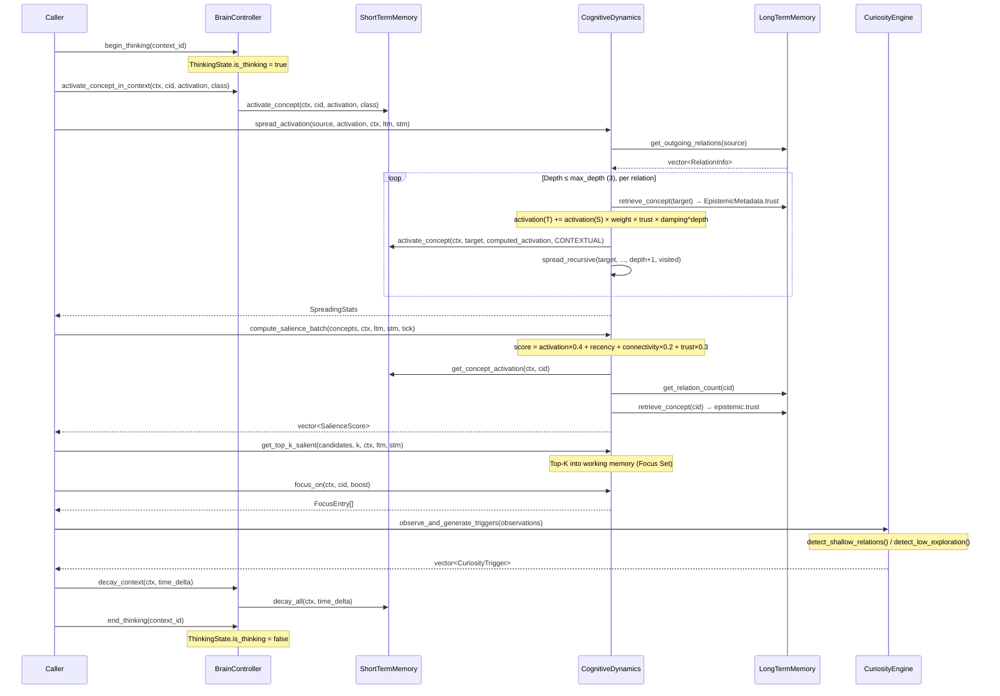

---

## 3. ThinkingPipeline — 10-Step Orchestrated Cycle

The heart of Brain19. SystemOrchestrator calls ThinkingPipeline::execute() which runs all 10 steps sequentially.

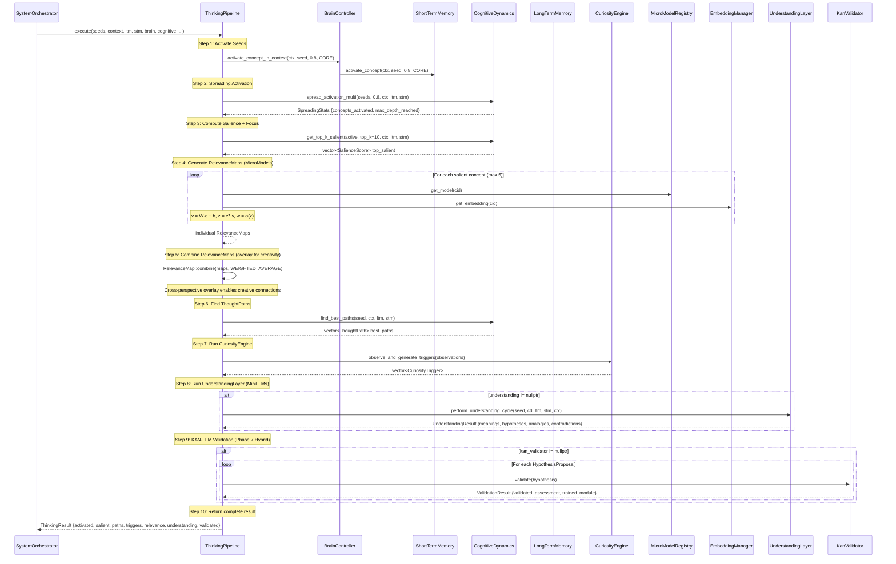

---

## 4. Learning Flow — Knowledge Ingestion

From external sources through the IngestionPipeline to LTM — with human review.

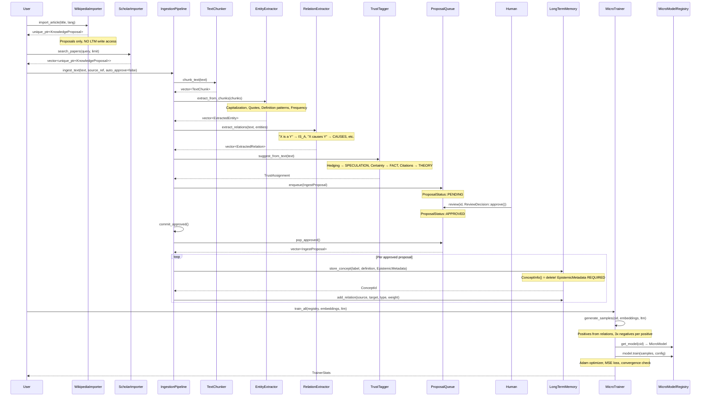

---

## 5. Query/Chat Flow — User Question

From user question through keyword search, spreading activation, and MicroModel relevance to LLM answer.

---

## 6. Understanding Cycle — Semantic Analysis

UnderstandingLayer uses CognitiveDynamics for focus and Mini-LLMs for semantic proposals.

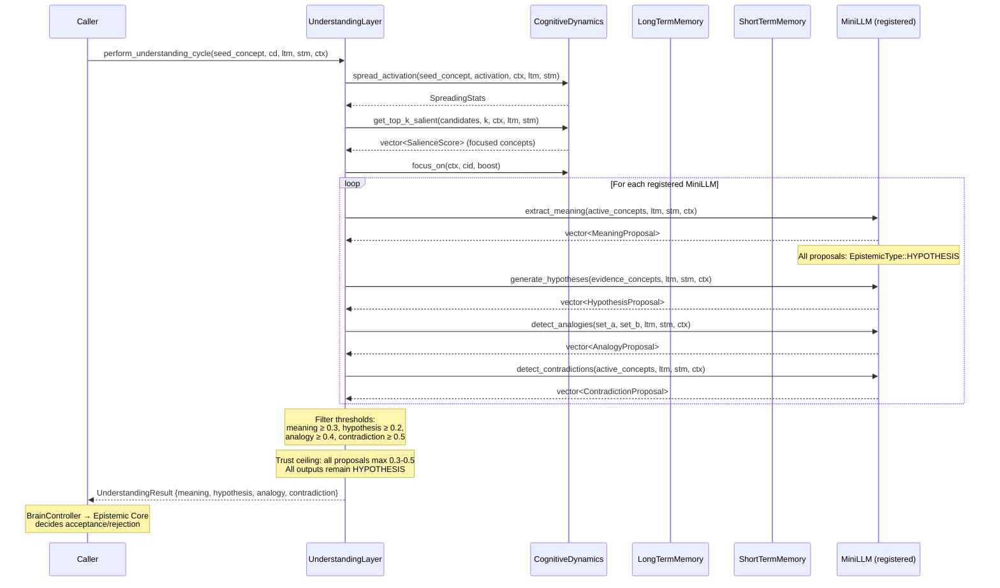

---

## 7. KAN-LLM Hybrid Validation — Phase 7

The complete LLM → KAN validation pipeline. HypothesisTranslator converts linguistic hypotheses to KAN training problems, KANModule trains, EpistemicBridge assigns trust.

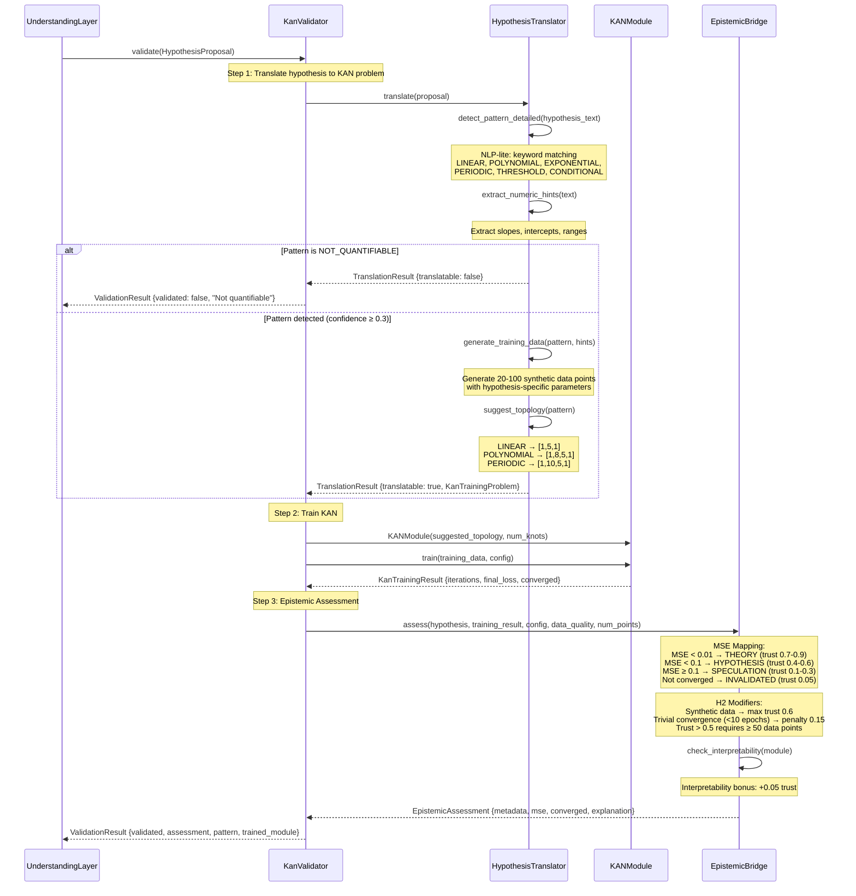

---

## 8. Refinement Loop — Bidirectional LLM↔KAN Dialog

The iterative refinement process: LLM generates hypothesis, KAN validates, residuals fed back.

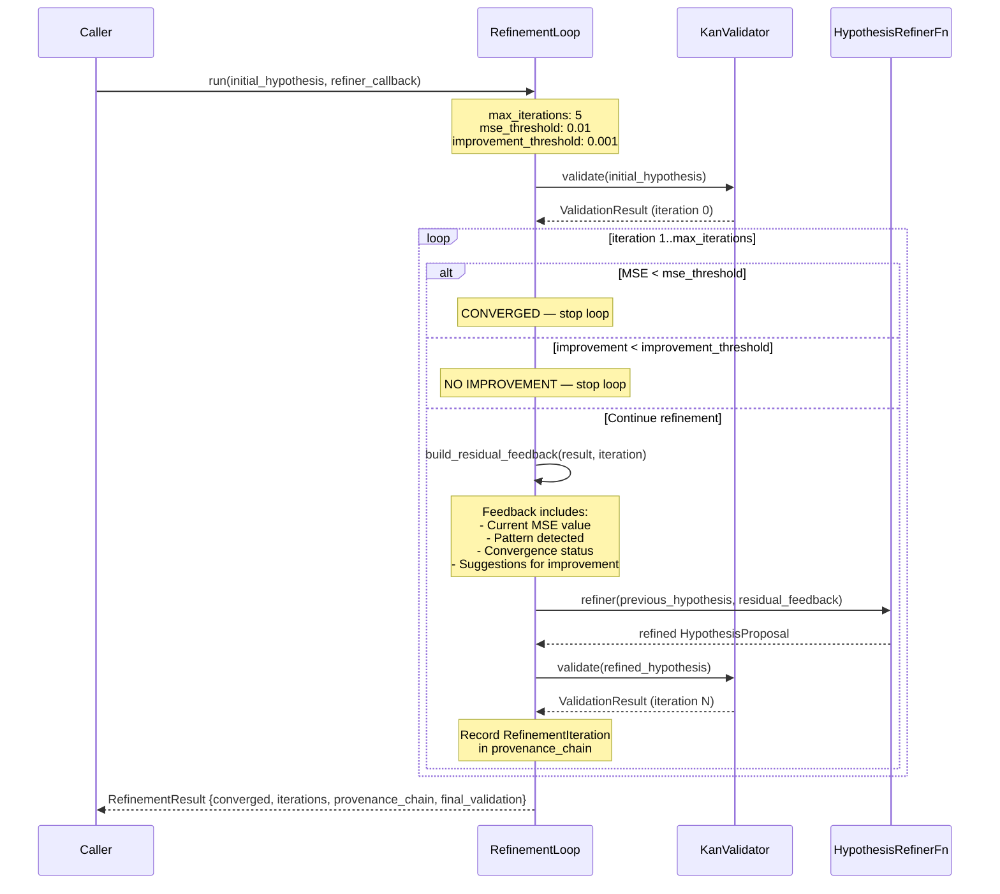

---

## 9. Dynamic Concept Evolution — Phase 6

Three engines that work together: PatternDiscovery finds structure, ConceptProposer generates new concepts, EpistemicPromotion manages lifecycle.

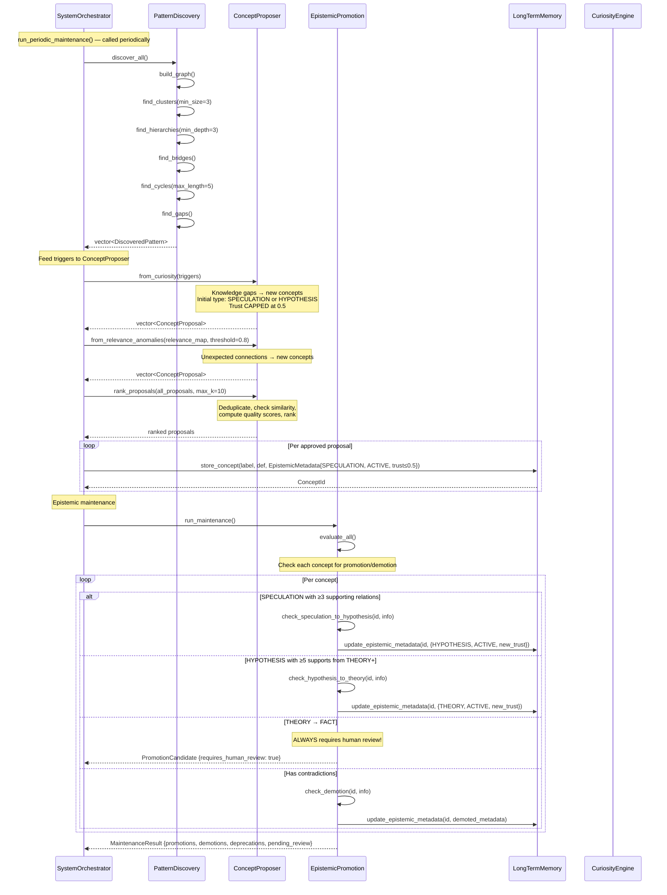

---

## 10. Curiosity → Action

CuriosityEngine detects knowledge gaps and triggers follow-up actions.

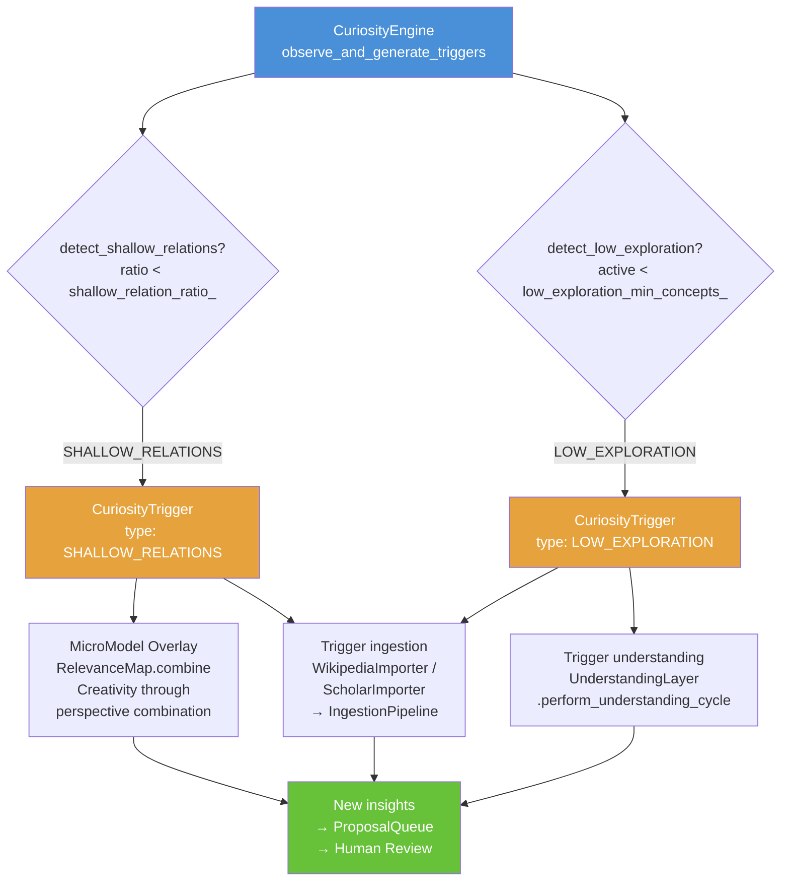

---

## 11. Component Dependency — Ownership & Access

Ownership, read-only, and write access between components.

```mermaid
flowchart TD
    subgraph Ownership["Ownership (unique_ptr)"]
        SO[SystemOrchestrator] -->|owns| BC[BrainController]
        SO -->|owns| LTM[LongTermMemory]
        SO -->|owns| CD[CognitiveDynamics]
        SO -->|owns| CE[CuriosityEngine]
        SO -->|owns| MR[MicroModelRegistry]
        SO -->|owns| EM[EmbeddingManager]
        SO -->|owns| MT[MicroTrainer]
        SO -->|owns| KA[KANAdapter]
        SO -->|owns| UL[UnderstandingLayer]
        SO -->|owns| KV[KanValidator]
        SO -->|owns| DM[DomainManager]
        SO -->|owns| RL[RefinementLoop]
        SO -->|owns| IP[IngestionPipeline]
        SO -->|owns| CI[ChatInterface]
        SO -->|owns| SORCH[StreamOrchestrator]
        SO -->|owns| PD[PatternDiscovery]
        SO -->|owns| EP[EpistemicPromotion]
        SO -->|owns| CP[ConceptProposer]
        SO -->|owns| TP[ThinkingPipeline]
        BC -->|owns| STM[ShortTermMemory]
        KM[KANModule] -->|owns| KL["vector<KANLayer>"]
        KL -->|owns| KN[KANNode]
        UL -->|owns| ML["vector<MiniLLM>"]
        IP -->|owns| PQ[ProposalQueue]
        IP -->|owns| TC[TextChunker]
        IP -->|owns| EE[EntityExtractor]
        IP -->|owns| RE[RelationExtractor]
        IP -->|owns| TT[TrustTagger]
        CI -->|owns| OC["OllamaClient"]
    end

    subgraph ReadOnly["Read-Only Access"]
        CD -.->|reads| LTM
        CD -.->|reads| STM
        UL -.->|reads| LTM
        UL -.->|reads| STM
        CE -.->|reads| STM
        CI -.->|reads| LTM
        RM[RelevanceMap] -.->|reads| LTM
        MT -.->|reads| LTM
        PD -.->|reads| LTM
        CP -.->|reads| LTM
        DM -.->|reads| LTM
    end

    subgraph WriteAccess["Write Access"]
        CD ==>|writes| STM
        IP ==>|writes| LTM
        MT ==>|writes| MR
        BC ==>|writes| STM
        EP ==>|writes| LTM
    end

    style SO fill:#2563eb,color:#fff
    style LTM fill:#16a34a,color:#fff
    style STM fill:#d97706,color:#fff
    style MR fill:#6b7280,color:#fff
```

---

## 12. Data Lifecycle — Concepts, MicroModels, STM

Lifecycles of concepts, MicroModels, and STM entries.

```mermaid
flowchart TD
    subgraph Concept["Concept Lifecycle"]
        I1[Input: Text/URL/JSON] --> ING[IngestionPipeline]
        ING --> PQ1[ProposalQueue<br/>PENDING]
        PQ1 -->|Human approve| AP[APPROVED]
        PQ1 -->|Human reject| RJ[REJECTED]
        AP --> SC[LTM.store_concept<br/>EpistemicStatus::ACTIVE]
        SC --> ACT[ACTIVE<br/>trust per TrustTagger]
        ACT -->|update_epistemic_metadata| SUP[SUPERSEDED<br/>replaced by better knowledge]
        ACT -->|invalidate_concept| INV[INVALIDATED<br/>trust = 0.05<br/>remains in LTM!]
        ACT -->|update_epistemic_metadata| CTX[CONTEXTUAL<br/>valid only in specific contexts]
    end

    subgraph MicroML["MicroModel Lifecycle"]
        MM1[MicroModel created<br/>Random W, b init] --> TR[MicroTrainer.train_single<br/>Adam optimizer]
        TR --> INF["Inference<br/>predict(e, c) → w"]
        INF -->|New relations in LTM| TR
        TR -->|converged=true| CONV[Converged<br/>final_loss < threshold]
    end

    subgraph STMLife["STM Entry Lifecycle"]
        ACT2[activate_concept<br/>CORE / CONTEXTUAL] --> LIVE[Active<br/>activation > 0]
        LIVE -->|decay_all| DEC[Decay<br/>activation -= rate × Δt]
        DEC -->|below removal_threshold| PRU[Pruned<br/>Entry removed]
        LIVE -->|boost_concept| LIVE
    end

    style I1 fill:#4a90d9,color:#fff
    style ACT fill:#67c23a,color:#fff
    style INV fill:#f56c6c,color:#fff
    style RJ fill:#909399,color:#fff
    style CONV fill:#67c23a,color:#fff
    style PRU fill:#909399,color:#fff
```

---

## 13. Multi-Stream Architecture

StreamOrchestrator manages N ThinkStreams working in parallel on shared state.

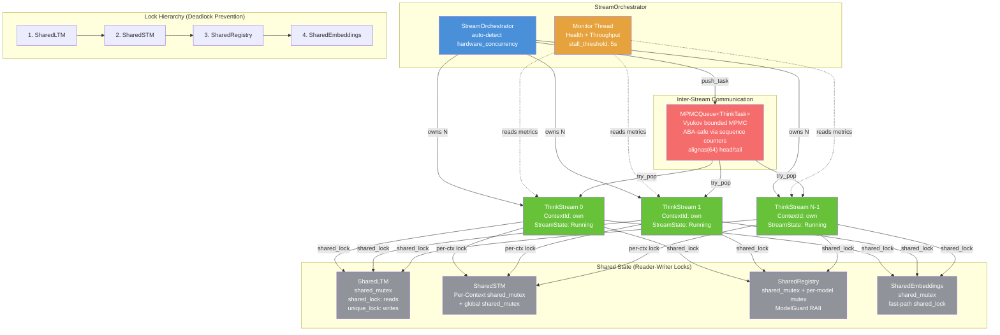

---

## 14. Multi-Stream Thinking Cycle

Lifecycle of a ThinkStream: start, autonomous tick loop with subsystems, backoff, and graceful shutdown.

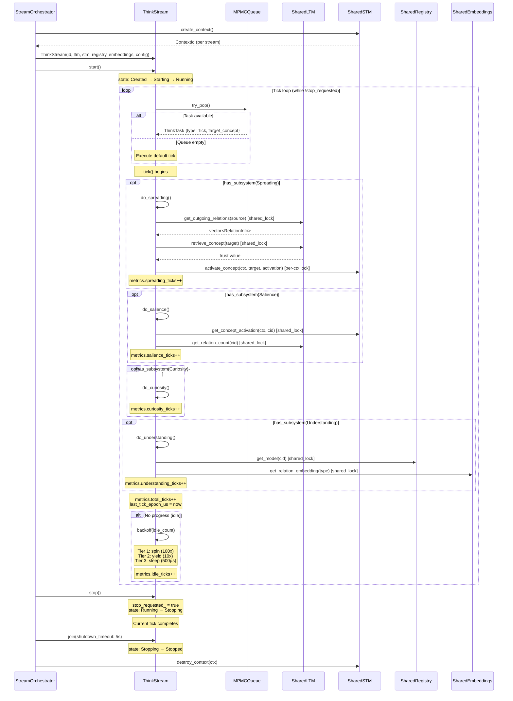

---

## 15. System Initialization Sequence

SystemOrchestrator::initialize() brings up all 14 subsystem groups in dependency order.

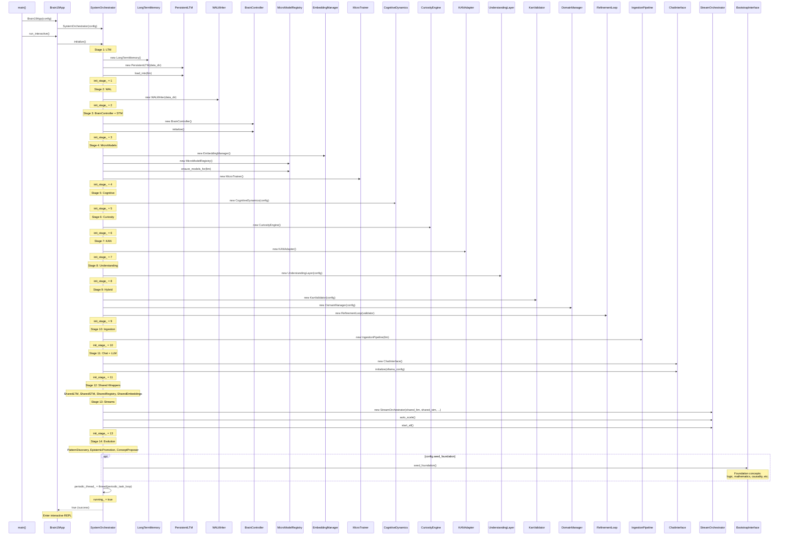

---

## 16. Checkpoint & Restore Flow

Full state persistence: checkpoint saves everything, restore rebuilds from checkpoint.

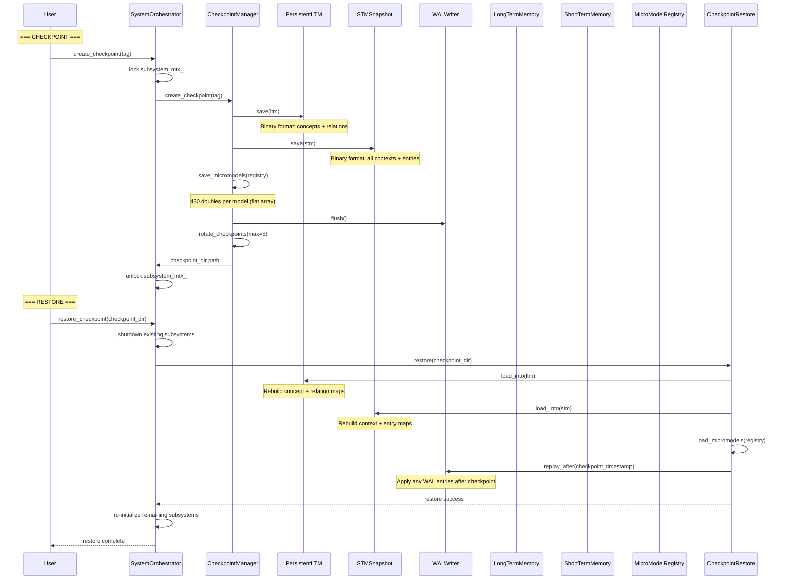

---

## 17. Full-Stack Deployment

Three-tier architecture: C++ backend binary, Python API bridge, React frontend.

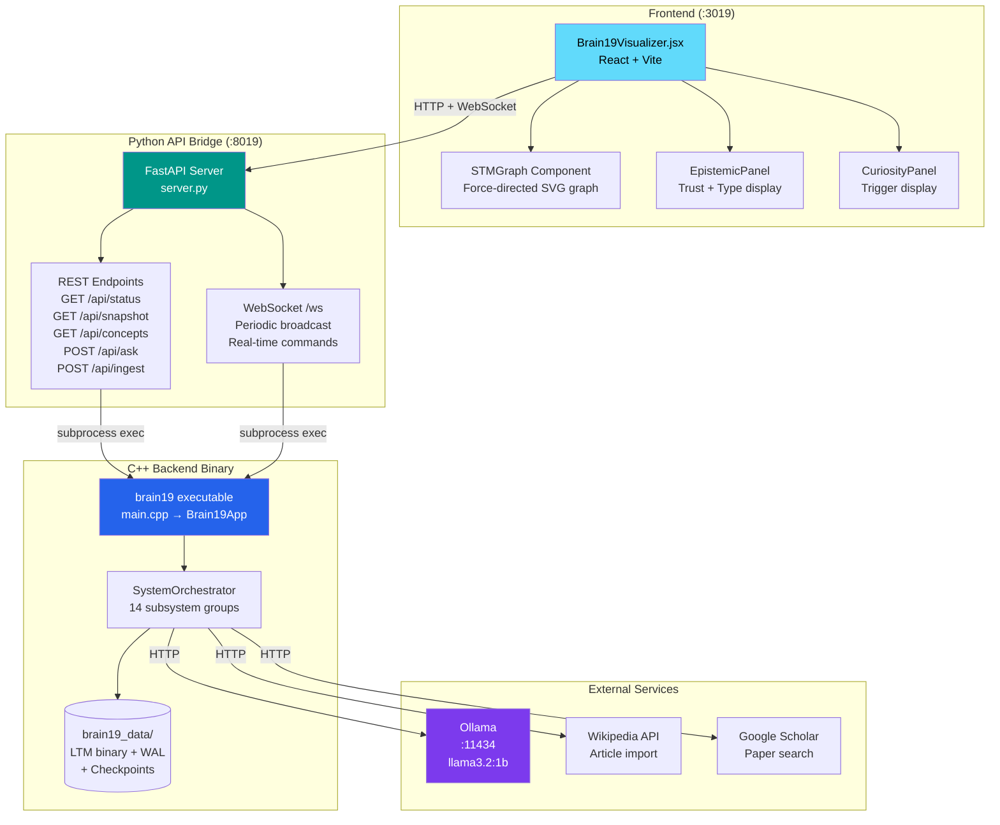

---

*Generated from actual code in `backend/`, `api/`, and `frontend/`. Updated: 2026-02-12.*
