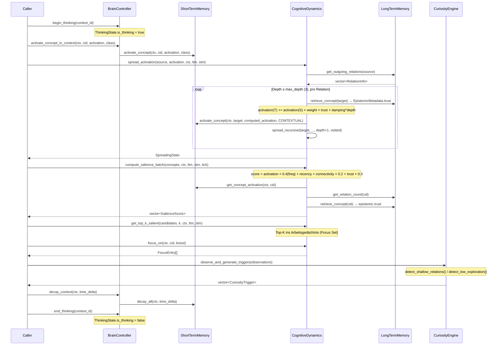
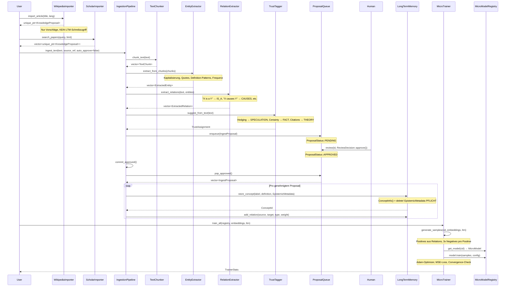
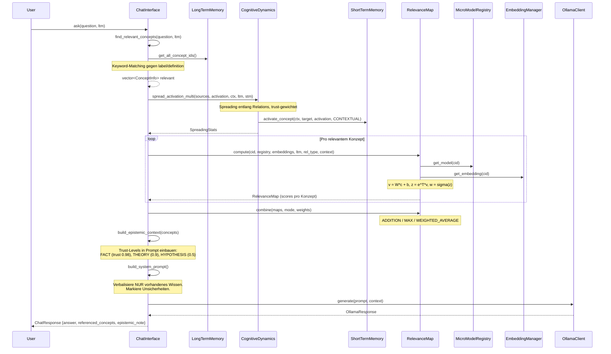
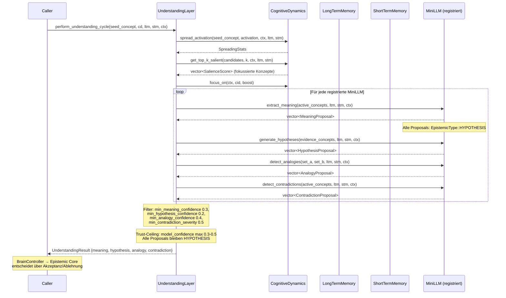

# Brain19 — Architecture Diagrams

> Dynamische Flows der C++20 Cognitive Architecture.  
> Alle Methoden- und Klassennamen entsprechen dem tatsächlichen Code in `backend/`.

---

## 1. THINKING CYCLE — Kompletter Tick

Ein einzelner Denk-Tick: BrainController orchestriert, CognitiveDynamics rechnet, CuriosityEngine beobachtet.

---

## 2. LEARNING FLOW — Neues Wissen integrieren

Von externen Quellen über die IngestionPipeline bis in LTM — mit Human Review.

---

## 3. QUERY/CHAT FLOW — User stellt Frage

Von der User-Frage über Keyword-Suche, Spreading Activation und MicroModel-Relevanz bis zur LLM-Antwort.

---

## 4. UNDERSTANDING CYCLE — Semantische Analyse

UnderstandingLayer nutzt CognitiveDynamics für Fokus und Mini-LLMs für semantische Vorschläge.

---

## 5. CURIOSITY → ACTION

CuriosityEngine erkennt Wissenslücken und triggert Folgeaktionen.

---

## 6. COMPONENT DEPENDENCY

Ownership, Read-Only und Write-Zugriff zwischen Komponenten.

```mermaid
flowchart TD
    subgraph Ownership["Ownership (unique_ptr)"]
        BC[BrainController] -->|owns| STM[ShortTermMemory]
        KM[KANModule] -->|owns| KL["vector unique_ptr KANLayer"]
        KL -->|owns| KN[KANNode]
        UL[UnderstandingLayer] -->|owns| ML["vector unique_ptr MiniLLM"]
        IP[IngestionPipeline] -->|owns| PQ[ProposalQueue]
        IP -->|owns| TC[TextChunker]
        IP -->|owns| EE[EntityExtractor]
        IP -->|owns| RE[RelationExtractor]
        IP -->|owns| TT[TrustTagger]
        CI[ChatInterface] -->|owns| OC["unique_ptr OllamaClient"]
    end

    subgraph ReadOnly["Read-Only Zugriff"]
        CD[CognitiveDynamics] -.->|reads| LTM[LongTermMemory]
        CD -.->|reads| STM
        UL -.->|reads| LTM
        UL -.->|reads| STM
        CE[CuriosityEngine] -.->|reads| STM
        CI -.->|reads| LTM
        RM[RelevanceMap] -.->|reads| LTM
        MT[MicroTrainer] -.->|reads| LTM
    end

    subgraph WriteAccess["Write-Zugriff"]
        CD ==>|writes| STM
        IP ==>|writes| LTM
        MT ==>|writes| MR[MicroModelRegistry]
        BC ==>|writes| STM
    end

    style BC fill:#4a90d9,color:#fff
    style LTM fill:#67c23a,color:#fff
    style STM fill:#e6a23c,color:#fff
    style MR fill:#909399,color:#fff
```

---

## 7. DATA LIFECYCLE

Lebenszyklen von Konzepten, MicroModels und STM-Einträgen.

---

*Generiert aus dem tatsächlichen Code in `backend/`. Stand: 2026-02-10.*
