# Brain19 — Class Diagrams

> Detailed UML class diagrams for all core module hierarchies.
> All class names, member variables, and method signatures match the actual code in `backend/`.
> Updated: 2026-02-12

---

## Table of Contents

1. [KAN Hierarchy](#1-kan-hierarchy)
2. [Memory Subsystem](#2-memory-subsystem)
3. [Epistemic System](#3-epistemic-system)
4. [MicroModel Layer](#4-micromodel-layer)
5. [KAN-LLM Hybrid System](#5-kan-llm-hybrid-system)
6. [Understanding Layer](#6-understanding-layer)
7. [Evolution System](#7-evolution-system)
8. [Ingestion Pipeline](#8-ingestion-pipeline)
9. [Streams & Concurrency](#9-streams--concurrency)
10. [Persistence Layer](#10-persistence-layer)
11. [Core Orchestration](#11-core-orchestration)

---

## 1. KAN Hierarchy

Kolmogorov-Arnold Networks: B-spline-based learnable function approximators.

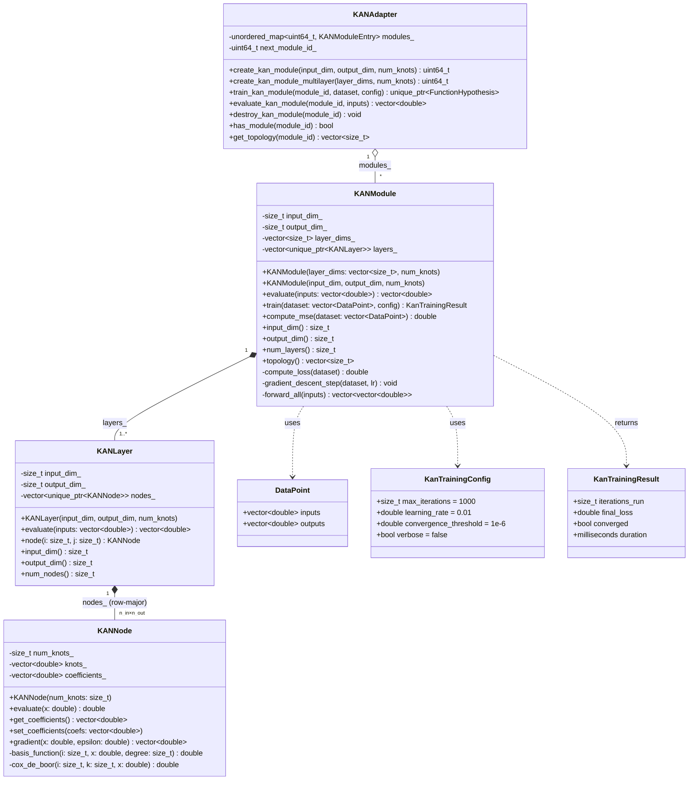

---

## 2. Memory Subsystem

LTM (knowledge graph) and STM (activation layer) with BrainController orchestration.

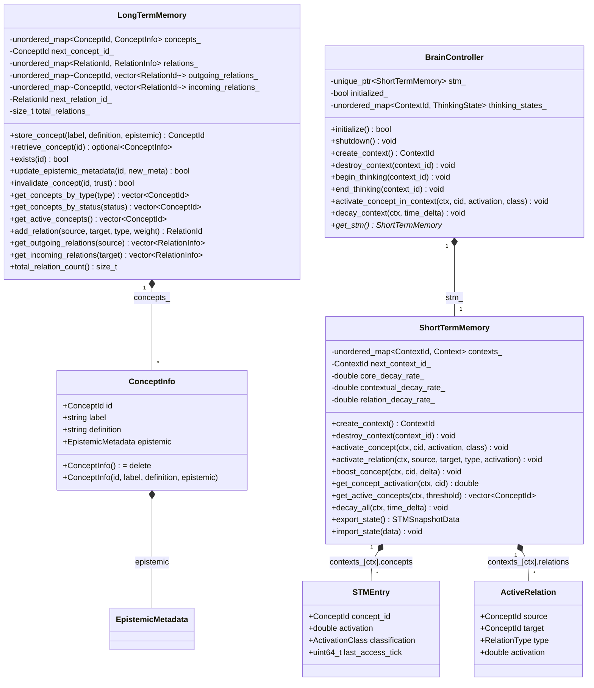

---

## 3. Epistemic System

Compile-time enforced epistemic metadata — the foundation of Brain19's knowledge integrity.

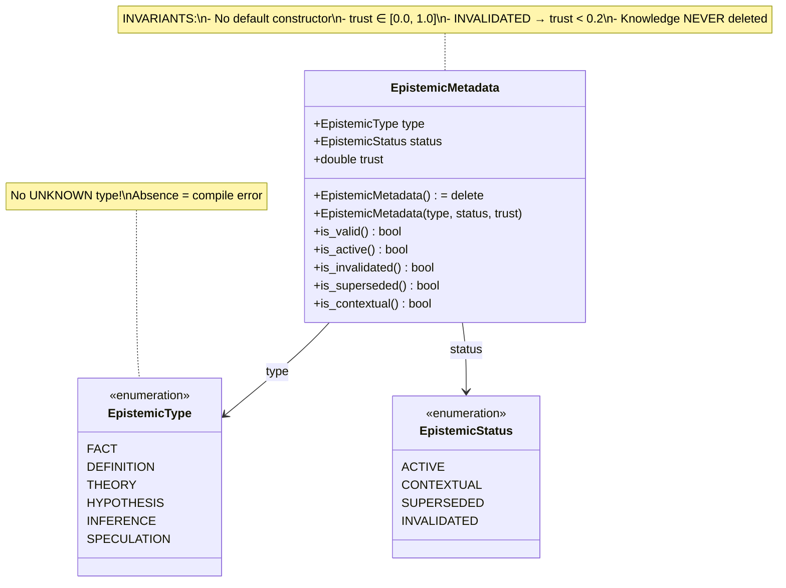

---

## 4. MicroModel Layer

Per-concept bilinear relevance models (430 parameters each).

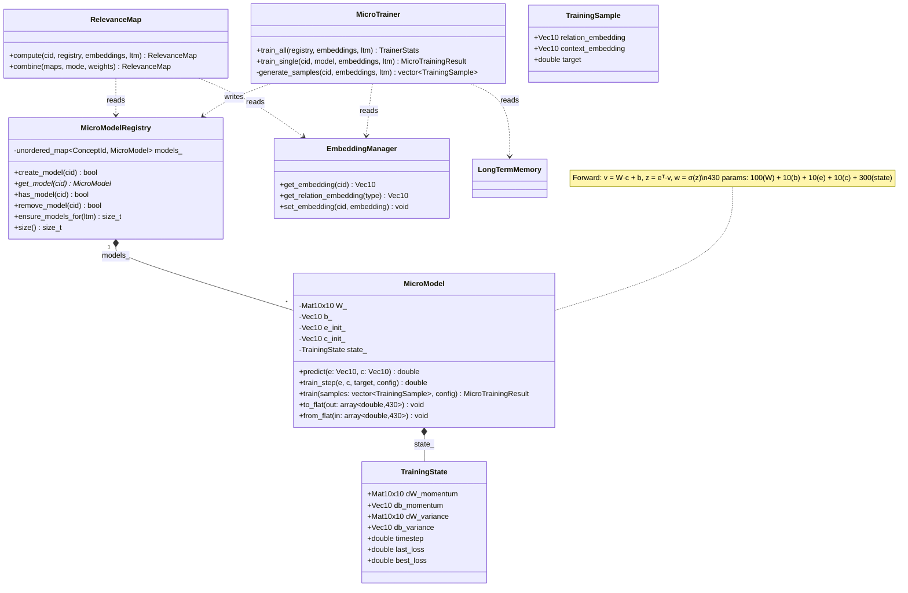

---

## 5. KAN-LLM Hybrid System

Phase 7: Linguistic hypotheses validated through KAN function approximation.

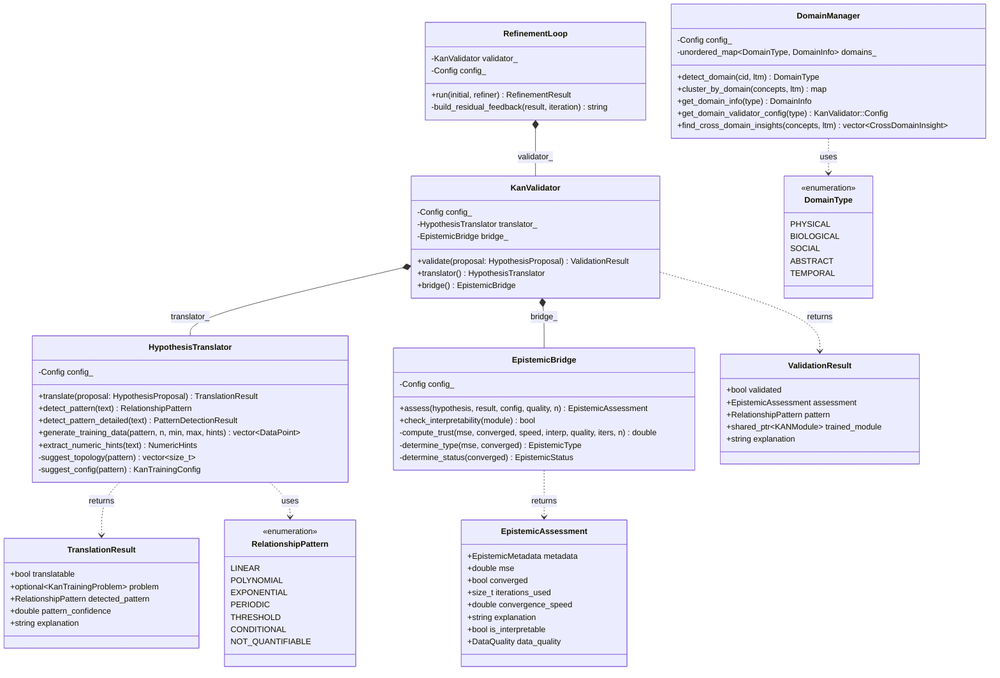

---

## 6. Understanding Layer

Semantic analysis via Mini-LLMs with strict epistemic boundaries.

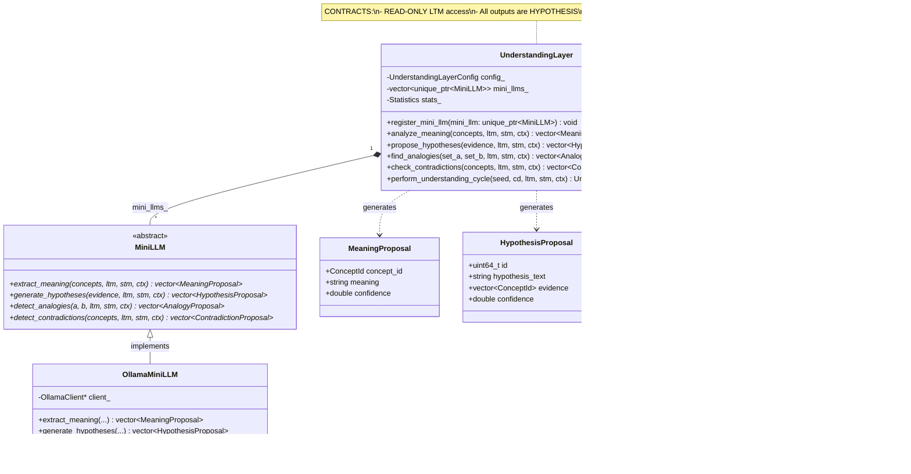

---

## 7. Evolution System

Dynamic concept generation and epistemic lifecycle management.

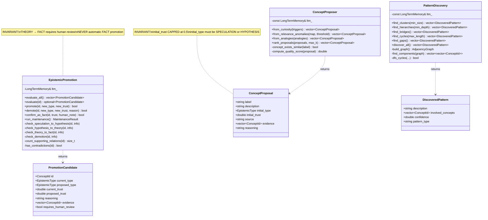

---

## 8. Ingestion Pipeline

From raw text/JSON/CSV to knowledge graph, with human review gate.

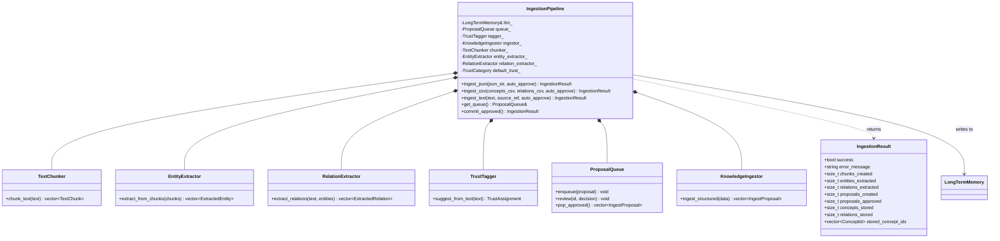

---

## 9. Streams & Concurrency

Multi-threaded thinking streams with lock-free communication.

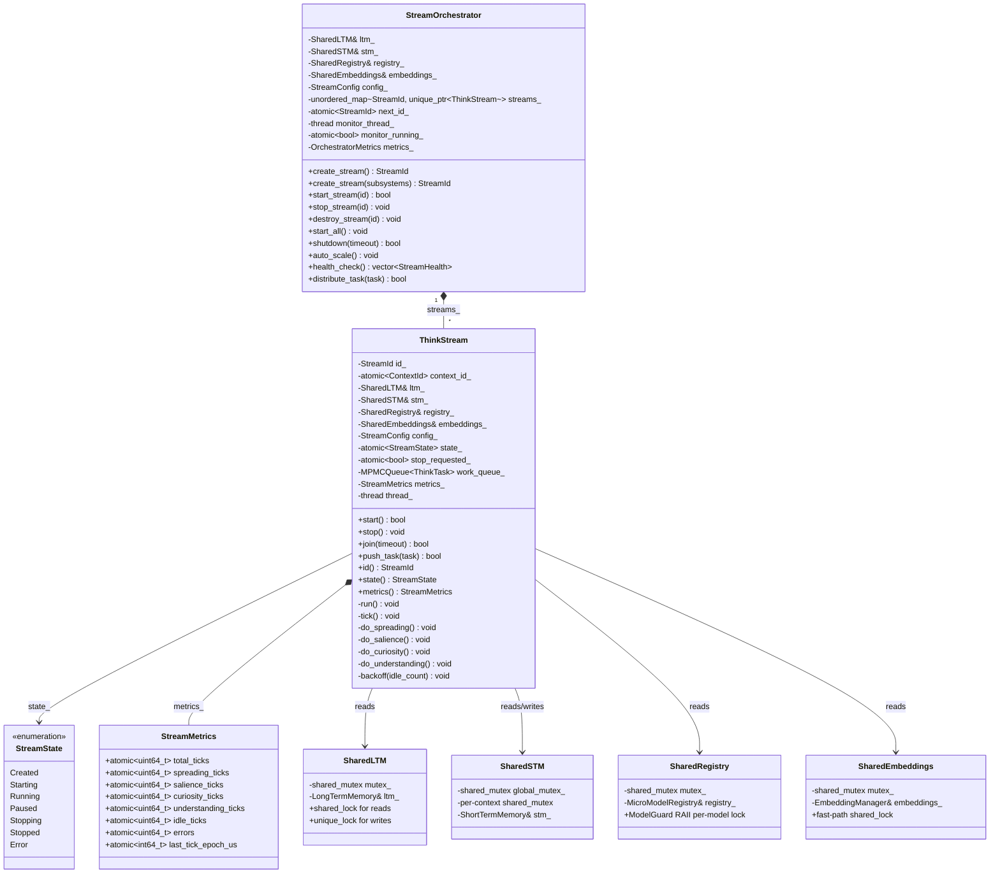

---

## 10. Persistence Layer

Binary persistence, WAL, and checkpoint management.

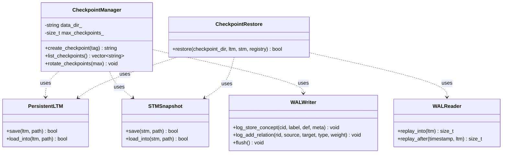

---

## 11. Core Orchestration

SystemOrchestrator owns all subsystems; Brain19App provides the user interface.

```mermaid
classDiagram
    class SystemOrchestrator {
        -Config config_
        -atomic~bool~ running_
        -int init_stage_
        -recursive_mutex subsystem_mtx_
        -unique_ptr~LongTermMemory~ ltm_
        -unique_ptr~PersistentLTM~ persistent_ltm_
        -unique_ptr~WALWriter~ wal_
        -unique_ptr~BrainController~ brain_
        -unique_ptr~EmbeddingManager~ embeddings_
        -unique_ptr~MicroModelRegistry~ registry_
        -unique_ptr~MicroTrainer~ trainer_
        -unique_ptr~CognitiveDynamics~ cognitive_
        -unique_ptr~CuriosityEngine~ curiosity_
        -unique_ptr~KANAdapter~ kan_adapter_
        -unique_ptr~UnderstandingLayer~ understanding_
        -unique_ptr~KanValidator~ kan_validator_
        -unique_ptr~DomainManager~ domain_manager_
        -unique_ptr~RefinementLoop~ refinement_loop_
        -unique_ptr~IngestionPipeline~ ingestion_
        -unique_ptr~ChatInterface~ chat_
        -unique_ptr~StreamOrchestrator~ stream_orch_
        -unique_ptr~PatternDiscovery~ pattern_discovery_
        -unique_ptr~EpistemicPromotion~ epistemic_promotion_
        -unique_ptr~ConceptProposer~ concept_proposer_
        -unique_ptr~ThinkingPipeline~ thinking_
        -thread periodic_thread_
        +initialize() bool
        +shutdown() void
        +ask(question) ChatResponse
        +ingest_text(text, auto_approve) IngestionResult
        +ingest_wikipedia(url) IngestionResult
        +create_checkpoint(tag) void
        +restore_checkpoint(dir) bool
        +run_thinking_cycle(seeds) ThinkingResult
        +run_periodic_maintenance() void
        +concept_count() size_t
        +relation_count() size_t
    }

    class Brain19App {
        -SystemOrchestrator orchestrator_
        +run_interactive() int
        +run_command(command, arg) int
        -cmd_ask(question) void
        -cmd_ingest(text) void
        -cmd_import(url) void
        -cmd_status() void
        -cmd_streams() void
        -cmd_checkpoint(tag) void
        -cmd_concepts() void
        -cmd_explain(id) void
        -cmd_think(label) void
        -cmd_help() void
    }

    class ThinkingPipeline {
        -Config config_
        +execute(seeds, ctx, ltm, stm, brain, cognitive, ...) ThinkingResult
        -step_activate_seeds(...)
        -step_spreading(...)
        -step_salience(...)
        -step_relevance(...)
        -step_thought_paths(...)
        -step_curiosity(...)
        -step_understanding(...)
        -step_kan_validation(...)
    }

    class ThinkingResult {
        +vector~ConceptId~ activated_concepts
        +vector~SalienceScore~ top_salient
        +vector~ThoughtPath~ best_paths
        +vector~CuriosityTrigger~ curiosity_triggers
        +RelevanceMap combined_relevance
        +UnderstandingResult understanding
        +vector~ValidationResult~ validated_hypotheses
        +size_t steps_completed
        +double total_duration_ms
    }

    Brain19App *-- SystemOrchestrator : orchestrator_
    SystemOrchestrator *-- ThinkingPipeline : thinking_
    ThinkingPipeline ..> ThinkingResult : returns
```

---

*Generated from actual code in `backend/`. Updated: 2026-02-12.*
