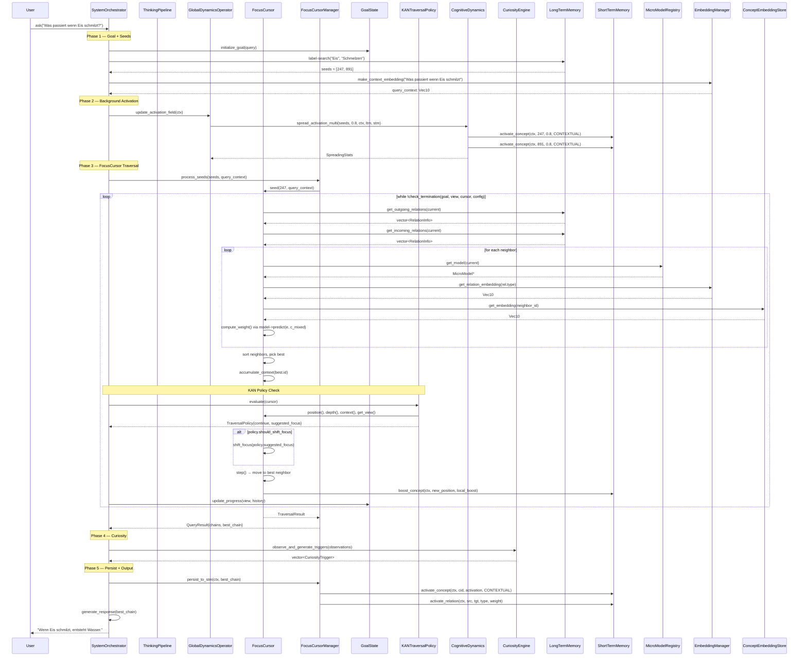
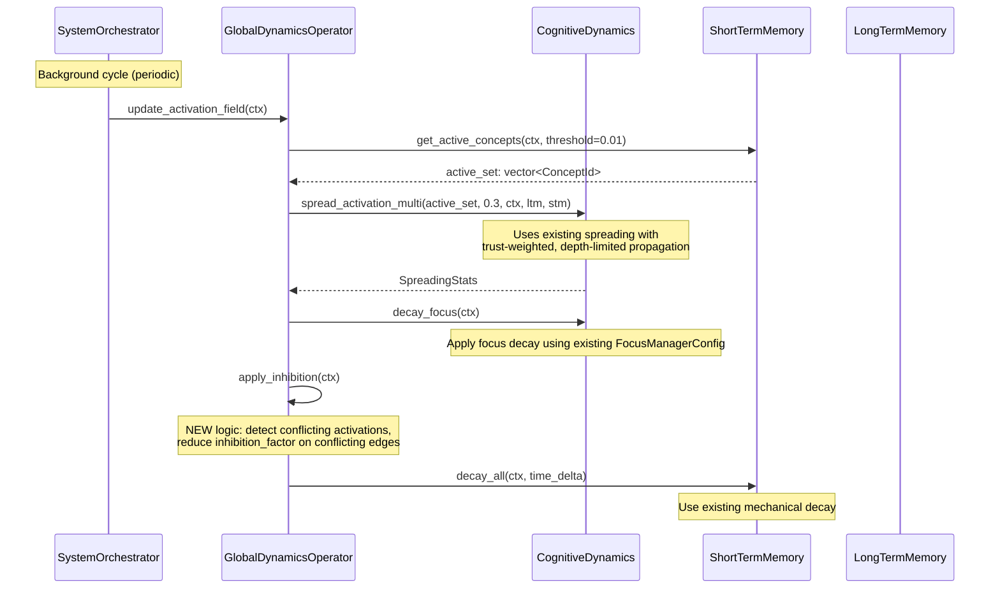
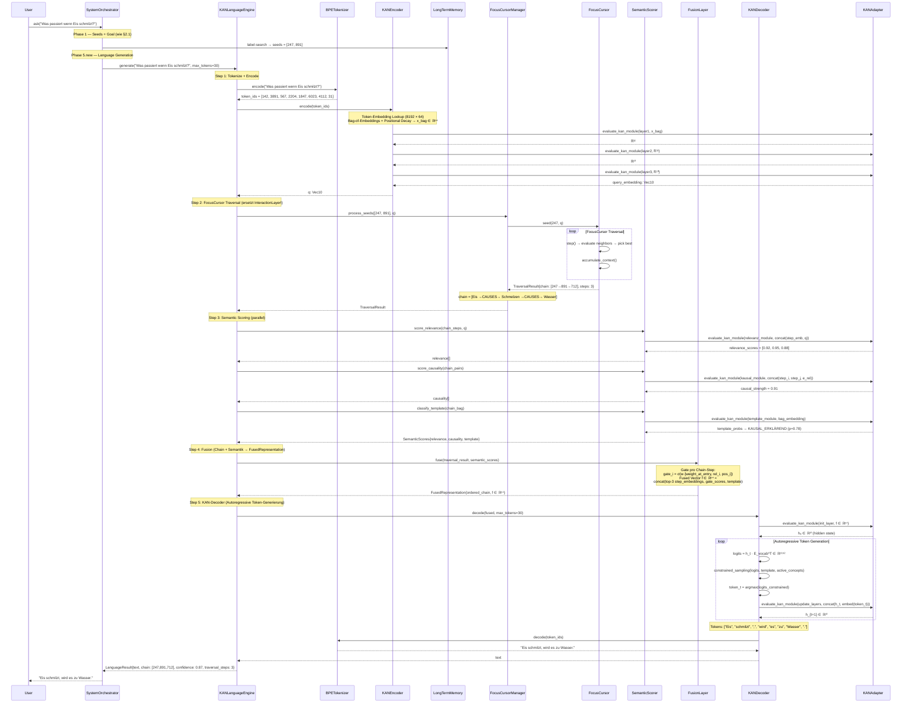
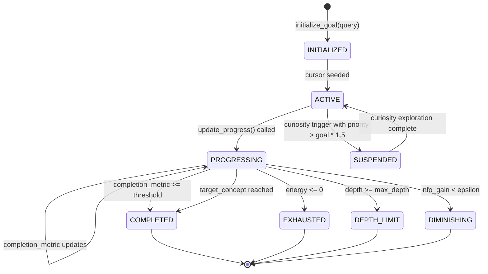
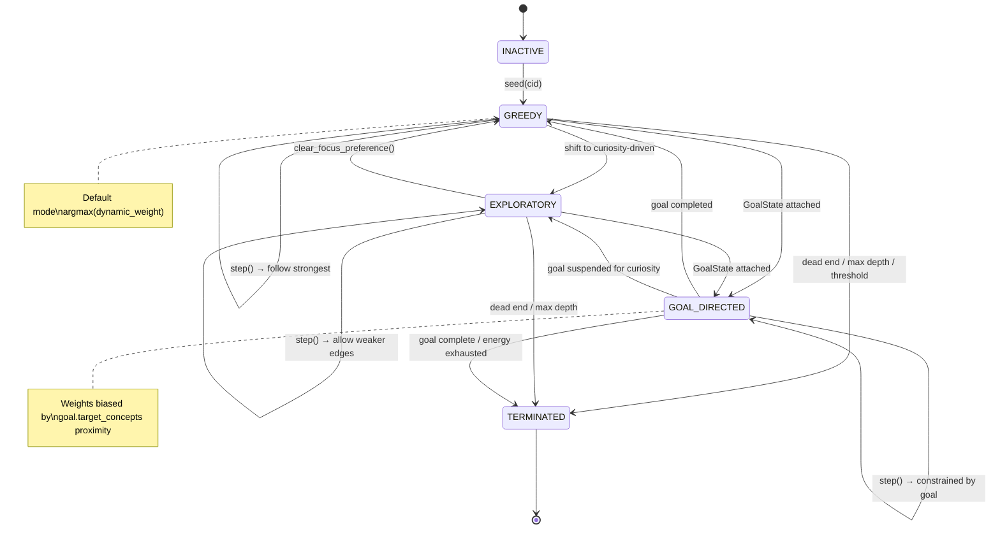
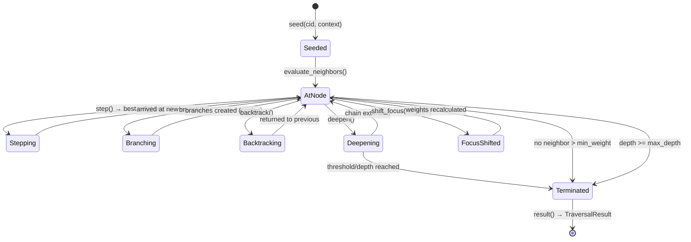
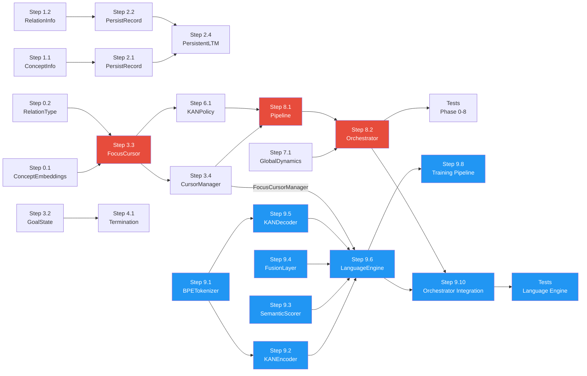

# Brain19 — Graph Architecture Integration Plan

**Datum:** 2026-02-12 (aktualisiert)
**Basis:** GRAPH_ARCHITECTURE_REFACTOR.md + REFACTOR_REVIEW.md + KAN_MINILLM_LANGUAGE_ENGINE.md
**Status:** Implementierungsplan mit korrigierten APIs + Language Engine Integration
**Prinzip:** Echte Namen, echte Typen, echte Abhängigkeiten

---

## 0. API-Korrektur-Tabelle

Jeder Bezeichner aus dem Refactor-Plan, der nicht zum Code passt, wird hier auf den echten Namen gemappt.

| Refactor-Plan (falsch) | Echter Code | Datei |
|------------------------|------------|-------|
| `struct Concept` | `struct ConceptInfo` | `ltm/long_term_memory.hpp:22` |
| `struct Relation` | `struct RelationInfo` | `ltm/relation.hpp:28` |
| `source_id` / `target_id` | `source` / `target` | `ltm/relation.hpp:30-31` |
| `VecN` | `Vec10 = std::array<double, 10>` | `micromodel/micro_model.hpp:29` |
| `VecN embedding` (in Concept) | **existiert nicht** | — |
| `get_concept_embedding()` | **existiert nicht** | — |
| `CuriosityTrigger::trigger_type` | `CuriosityTrigger::type` | `curiosity/curiosity_trigger.hpp:23` |
| `CuriosityTrigger::target_node_id` | `related_concept_ids` (vector) | `curiosity/curiosity_trigger.hpp:25` |
| `CuriosityTrigger::priority` | **existiert nicht** | — |
| `TriggerType::LOW_CONFIDENCE` | `TriggerType::SHALLOW_RELATIONS` | `curiosity/curiosity_trigger.hpp:13` |
| `TriggerType::UNEXPLORED_REGION` | `TriggerType::LOW_EXPLORATION` | `curiosity/curiosity_trigger.hpp:15` |
| `TriggerType::CONTRADICTION` | **existiert nicht** | — |
| `TriggerType::HIGH_NOVELTY` | **existiert nicht** | — |
| `curiosity.get_pending_triggers()` | `observe_and_generate_triggers(obs)` | `curiosity/curiosity_engine.hpp:35` |
| `kan_policy_.evaluate(cursor)` | **existiert nicht** | — |
| `LanguageEngine` | **existiert nicht** | — |
| `Brain19ControlLoop` | **existiert nicht** | — |
| `GlobalDynamicsOperator` | **existiert nicht** | — |
| `PRODUCES` | **existiert nicht** (use `CUSTOM`) | `memory/active_relation.hpp` |
| `REQUIRES` | **existiert nicht** (use `ENABLES` inverse) | `memory/active_relation.hpp` |
| `USES` | **existiert nicht** (use `CUSTOM`) | `memory/active_relation.hpp` |
| `HAS_PART` | `PART_OF` (inverse Richtung) | `memory/active_relation.hpp:16` |
| **Language Engine (KAN_MINILLM_LANGUAGE_ENGINE.md)** | | |
| `InteractionLayer& interaction` | `FocusCursorManager& cursor_manager` | Konstruktor-Parameter |
| `InteractionLayer::propagate()` | `FocusCursorManager::process_seeds()` | Reasoning-Mechanismus |
| `InteractionResult` | `TraversalResult` | `cursor/traversal_types.hpp` |
| `VecN` (Language Engine Kontext) | `Vec10 = std::array<double, 10>` | `micromodel/micro_model.hpp:29` |
| `Vec16` (Query-Embedding ℝ¹⁶) | **existiert nicht** — `EMBED_DIM = 10` | — |
| `ReasoningLayer` (Klasse) | **wird eliminiert** — absorbiert durch `FocusCursorManager` | — |
| `interaction_cycles` (in LanguageResult) | `traversal_steps` | Sprachausgabe-Metadaten |
| `ℝ⁶⁴ → ℝ³² → ℝ¹⁶` (Encoder) | `ℝ⁶⁴ → ℝ³² → ℝ¹⁰` (passt zu Vec10) | KAN-Encoder Dimensionen |
| `ℝ⁸⁰ → ℝ³² → ℝ¹⁶` (Decoder Update) | `ℝ⁷⁴ → ℝ³² → ℝ¹⁰` (10+64=74) | KAN-Decoder Update Dimensionen |
| `concat(a*_i, query) ∈ ℝ³²` (Scorer) | `concat(chain_emb, query) ∈ ℝ²⁰` (10+10=20) | SemanticScorer Relevanz-Input |
| `concat(a*_i, a*_j, e_rel) ∈ ℝ⁴⁸` | `concat(step_emb, next_emb, e_rel) ∈ ℝ³⁰` | SemanticScorer Kausalitäts-Input |

---

## 1. UML Class Diagrams

### 1.1 IST-Zustand — Kern-Datenstrukturen

```mermaid
classDiagram
    class ConceptInfo {
        +ConceptId id
        +string label
        +string definition
        +EpistemicMetadata epistemic
        +ConceptInfo(id, label, definition, epistemic)
        -ConceptInfo() = delete
    }

    class RelationInfo {
        +RelationId id
        +ConceptId source
        +ConceptId target
        +RelationType type
        +double weight
        +RelationInfo(id, src, tgt, type, weight)
        -RelationInfo() = delete
        -clamp_weight(w) double
    }

    class EpistemicMetadata {
        +EpistemicType type
        +EpistemicStatus status
        +double trust
        +is_valid() bool
        +is_active() bool
        +is_invalidated() bool
    }

    class LongTermMemory {
        -unordered_map~ConceptId,ConceptInfo~ concepts_
        -unordered_map~RelationId,RelationInfo~ relations_
        +store_concept(label, def, epistemic) ConceptId
        +retrieve_concept(id) optional~ConceptInfo~
        +add_relation(src, tgt, type, weight) RelationId
        +get_outgoing_relations(src) vector~RelationInfo~
        +get_incoming_relations(tgt) vector~RelationInfo~
    }

    class MicroModel {
        -Mat10x10 W_
        -Vec10 b_
        -Vec10 e_init_
        -Vec10 c_init_
        -TrainingState state_
        +predict(e: Vec10, c: Vec10) double
        +train_step(e, c, target, config) double
        +to_flat(out) void
        +from_flat(in) void
    }

    class EmbeddingManager {
        -array~Vec10,10~ relation_embeddings_
        -unordered_map~string,Vec10~ context_embeddings_
        +get_relation_embedding(type) Vec10
        +get_context_embedding(name) Vec10
        +make_context_embedding(name) Vec10
        +make_target_embedding(hash, src, tgt) Vec10
    }

    class MicroModelRegistry {
        -unordered_map~ConceptId,MicroModel~ models_
        +create_model(cid) bool
        +get_model(cid) MicroModel*
        +has_model(cid) bool
        +ensure_models_for(ltm) size_t
    }

    class CuriosityEngine {
        -double shallow_relation_ratio_
        -size_t low_exploration_min_concepts_
        +observe_and_generate_triggers(obs) vector~CuriosityTrigger~
    }

    class CuriosityTrigger {
        +TriggerType type
        +ContextId context_id
        +vector~ConceptId~ related_concept_ids
        +string description
    }

    class CognitiveDynamics {
        -CognitiveDynamicsConfig config_
        -unordered_map~ContextId,vector~FocusEntry~~ focus_sets_
        +spread_activation(src, act, ctx, ltm, stm) SpreadingStats
        +compute_salience(cid, ctx, ltm, stm, tick) SalienceScore
        +get_top_k_salient(cands, k, ctx, ltm, stm) vector~SalienceScore~
        +find_best_paths(src, ctx, ltm, stm) vector~ThoughtPath~
        +focus_on(ctx, cid, boost) void
        +get_focus_set(ctx) vector~FocusEntry~
    }

    class KANAdapter {
        -unordered_map~uint64_t,KANModuleEntry~ modules_
        +create_kan_module(in, out, knots) uint64_t
        +train_kan_module(id, data, cfg) unique_ptr~FunctionHypothesis~
        +evaluate_kan_module(id, inputs) vector~double~
    }

    class ThinkingPipeline {
        -Config config_
        +execute(seeds, ctx, ltm, stm, brain, cognitive, curiosity, registry, embeddings, understanding, kan_validator) ThinkingResult
    }

    class SystemOrchestrator {
        -unique_ptr~LongTermMemory~ ltm_
        -unique_ptr~BrainController~ brain_
        -unique_ptr~EmbeddingManager~ embeddings_
        -unique_ptr~MicroModelRegistry~ registry_
        -unique_ptr~CognitiveDynamics~ cognitive_
        -unique_ptr~CuriosityEngine~ curiosity_
        -unique_ptr~KANAdapter~ kan_adapter_
        -unique_ptr~ThinkingPipeline~ thinking_
        -ContextId active_context_
        +initialize() bool
        +ask(question) ChatResponse
        +run_thinking_cycle(seeds) ThinkingResult
    }

    ConceptInfo *-- EpistemicMetadata
    LongTermMemory o-- ConceptInfo
    LongTermMemory o-- RelationInfo
    MicroModelRegistry o-- MicroModel
    CuriosityEngine ..> CuriosityTrigger : produces
    SystemOrchestrator *-- LongTermMemory
    SystemOrchestrator *-- MicroModelRegistry
    SystemOrchestrator *-- EmbeddingManager
    SystemOrchestrator *-- CognitiveDynamics
    SystemOrchestrator *-- CuriosityEngine
    SystemOrchestrator *-- KANAdapter
    SystemOrchestrator *-- ThinkingPipeline
    ThinkingPipeline ..> CognitiveDynamics : uses
    ThinkingPipeline ..> CuriosityEngine : uses
    ThinkingPipeline ..> MicroModelRegistry : uses
```



### 1.2 SOLL-Zustand — Erweiterte + Neue Strukturen

```mermaid
classDiagram
    class ConceptInfo {
        +ConceptId id
        +string label
        +string definition
        +EpistemicMetadata epistemic
        +double activation_score
        +double salience_score
        +double structural_confidence
        +double semantic_confidence
        +ConceptInfo(id, label, def, epistemic)
    }
    note for ConceptInfo "4 neue Felder, Defaults = 0.0
Constructor bleibt gleich (Defaults)
Keine API-Änderung für existierende Caller"

    class RelationInfo {
        +RelationId id
        +ConceptId source
        +ConceptId target
        +RelationType type
        +double weight
        +double dynamic_weight
        +double inhibition_factor
        +double structural_strength
    }
    note for RelationInfo "3 neue Felder, Defaults = 0.0
Constructor: alte Signatur bleibt
Neue Felder via Setter oder 2. Constructor"

    class ConceptEmbeddingStore {
        <<NEW>>
        -unordered_map~ConceptId,Vec10~ embeddings_
        +store_embedding(cid, emb) void
        +get_embedding(cid) optional~Vec10~
        +has_embedding(cid) bool
        +compute_from_label(label) Vec10
        +size() size_t
    }
    note for ConceptEmbeddingStore "Löst K4: get_concept_embedding()
Lebt im EmbeddingManager oder standalone
Berechnet aus Label-Hash + Heuristik"

    class GoalState {
        <<NEW>>
        +GoalType goal_type
        +vector~ConceptId~ target_concepts
        +double completion_metric
        +double threshold
        +double priority_weight
        +is_complete() bool
        +update_progress(view, history) void
    }

    class FocusCursorState {
        <<NEW>>
        +ConceptId current_node_id
        +vector~TraversalStep~ path_history
        +size_t depth
        +double accumulated_energy
        +ExplorationMode exploration_mode
    }

    class FocusCursor {
        <<NEW>>
        -const LongTermMemory& ltm_
        -MicroModelRegistry& registry_
        -EmbeddingManager& embeddings_
        -FocusCursorConfig config_
        -ConceptId current_
        -size_t depth_
        -Vec10 context_embedding_
        -vector~TraversalStep~ history_
        +seed(cid) void
        +seed(cid, initial_context: Vec10) void
        +step() optional~ConceptId~
        +step_to(target) bool
        +backtrack() bool
        +deepen() TraversalResult
        +shift_focus(rel) void
        +get_view() CursorView
        +position() ConceptId
        +branch(k) vector~FocusCursor~
        +result() TraversalResult
    }

    class FocusCursorManager {
        <<NEW>>
        -const LongTermMemory& ltm_
        -MicroModelRegistry& registry_
        -EmbeddingManager& embeddings_
        -ShortTermMemory& stm_
        +process_seeds(seeds, ctx) QueryResult
        +persist_to_stm(ctx, result) void
    }

    class TraversalPolicy {
        <<NEW>>
        +bool should_continue
        +RelationType suggested_focus
        +bool should_branch
        +size_t branch_count
    }

    class KANTraversalPolicy {
        <<NEW>>
        -KANAdapter& adapter_
        -uint64_t policy_module_id_
        +evaluate(cursor: FocusCursor) TraversalPolicy
        +train(episodes) void
    }
    note for KANTraversalPolicy "Wraps KANAdapter with cursor-aware
input encoding. Uses existing
KANAdapter::evaluate_kan_module()."

    class GlobalDynamicsOperator {
        <<NEW>>
        -CognitiveDynamics& cognitive_
        -LongTermMemory& ltm_
        -ShortTermMemory& stm_
        +update_activation_field(ctx) void
        +apply_inhibition(ctx) void
        +decay_all(ctx, dt) void
    }
    note for GlobalDynamicsOperator "Wraps CognitiveDynamics for
background activation management.
Does NOT replace CognitiveDynamics."

    class CuriosityTrigger {
        +TriggerType type
        +ContextId context_id
        +vector~ConceptId~ related_concept_ids
        +string description
        +double priority
    }
    note for CuriosityTrigger "Add: double priority (default 0.0)
Existing fields unchanged
Add new TriggerTypes to enum"

    class BPETokenizer {
        <<NEW — Language Engine>>
        -size_t vocab_size_
        -vector~pair~string,string~~ merges_
        -unordered_map~string,uint16_t~ token_to_id_
        -unordered_map~uint16_t,ConceptId~ token_concept_map_
        +encode(text) vector~uint16_t~
        +decode(tokens) string
        +token_to_concept(token) optional~ConceptId~
        +concept_to_token(cid) optional~uint16_t~
        +vocab_size() size_t
        +save(path) void
        +train(corpus, ltm, vocab_size)$ BPETokenizer
    }

    class KANEncoder {
        <<NEW — Language Engine>>
        -BPETokenizer& tokenizer_
        -KANAdapter& kan_
        -uint64_t layer1_id_
        -uint64_t layer2_id_
        -uint64_t layer3_id_
        -array~Vec64,8192~ token_embeddings_
        +encode(text) Vec10
    }
    note for KANEncoder "ℝ⁶⁴ → ℝ³² → ℝ¹⁰
    Korrigiert: Output Vec10 (nicht Vec16)
    Token-Embedding-Table: 8192 × 64 = 524K params"

    class SemanticScorer {
        <<NEW — Language Engine>>
        -KANAdapter& kan_
        -uint64_t relevanz_module_
        -uint64_t kausal_module_
        -uint64_t template_module_
        +score_relevance(chain_step_emb, query) double
        +score_causality(step_emb, next_emb, rel_emb) double
        +classify_template(chain_bag) TemplateType
    }
    note for SemanticScorer "3 spezialisierte KAN-Module
    Input-Dims korrigiert für Vec10"

    class FusionLayer {
        <<NEW — Language Engine>>
        -array~double,4~ w_gate_
        -double b_gate_
        +fuse(result: TraversalResult, semantics: SemanticScores) FusedRepresentation
    }
    note for FusionLayer "Input: TraversalResult chain (NICHT Attractor)
    Gate: σ(w·[weight_at_entry, rel_score, pos_in_chain])
    Output: FusedRepresentation ∈ ℝ⁶⁴"

    class KANDecoder {
        <<NEW — Language Engine>>
        -KANAdapter& kan_
        -BPETokenizer& tokenizer_
        -uint64_t init_layer_
        -uint64_t update_layer1_
        -uint64_t update_layer2_
        +decode(fused: FusedRepresentation, max_tokens) string
    }
    note for KANDecoder "Autoregressive Token-Generierung
    Hidden State: Vec10
    Output Projection: ℝ¹⁰ → ℝ⁸¹⁹²
    Template-Constraint Sampling"

    class KANLanguageEngine {
        <<NEW — Language Engine>>
        -LanguageConfig config_
        -BPETokenizer tokenizer_
        -KANEncoder encoder_
        -KANDecoder decoder_
        -SemanticScorer semantic_scorer_
        -FusionLayer fusion_
        -LongTermMemory& ltm_
        -MicroModelRegistry& registry_
        -EmbeddingManager& embeddings_
        -FocusCursorManager& cursor_manager_
        +generate(query, max_tokens) LanguageResult
        +encode(text) Vec10
        +find_seeds(text) vector~ConceptId~
        +score_semantics(result, query) SemanticScores
        +fuse(result, semantics) FusedRepresentation
        +decode(fused, max_tokens) string
        +save(dir) void
        +load(dir) void
    }
    note for KANLanguageEngine "Korrigiert: FocusCursorManager&
    statt InteractionLayer&
    ReasoningLayer eliminiert —
    FocusCursorManager übernimmt"

    class LanguageResult {
        <<NEW — Language Engine>>
        +string text
        +vector~ConceptId~ activated_concepts
        +vector~ConceptId~ causal_chain
        +double confidence
        +size_t traversal_steps
        +bool used_template
        +string template_type
    }
    note for LanguageResult "traversal_steps statt interaction_cycles
    causal_chain = TraversalResult.concept_sequence"

    FocusCursor *-- FocusCursorState
    FocusCursor ..> MicroModel : predict()
    FocusCursor ..> LongTermMemory : get_outgoing/incoming
    FocusCursor ..> EmbeddingManager : get_relation_embedding
    FocusCursor ..> ConceptEmbeddingStore : get_embedding
    FocusCursorManager *-- FocusCursor
    FocusCursorManager ..> ShortTermMemory : persist_to_stm
    KANTraversalPolicy ..> KANAdapter : evaluate_kan_module
    KANTraversalPolicy ..> FocusCursor : reads state
    GlobalDynamicsOperator ..> CognitiveDynamics : delegates

    KANLanguageEngine *-- BPETokenizer
    KANLanguageEngine *-- KANEncoder
    KANLanguageEngine *-- KANDecoder
    KANLanguageEngine *-- SemanticScorer
    KANLanguageEngine *-- FusionLayer
    KANLanguageEngine ..> FocusCursorManager : process_seeds()
    KANLanguageEngine ..> LongTermMemory : find_seeds()
    KANLanguageEngine ..> EmbeddingManager : embeddings
    KANEncoder ..> BPETokenizer : encode tokens
    KANEncoder ..> KANAdapter : KAN layers
    KANDecoder ..> BPETokenizer : decode tokens
    KANDecoder ..> KANAdapter : KAN layers
    SemanticScorer ..> KANAdapter : KAN modules
    FusionLayer ..> TraversalResult : chain input
```



---

## 2. UML Sequence Diagrams

### 2.1 Neuer Control Loop: `ask(question)` Komplett-Ablauf



### 2.2 GlobalDynamicsOperator ↔ CognitiveDynamics Delegation



### 2.3 Language Generation: Query → FocusCursor → KAN-Decoder → Text



**Schlüsseländerung vs. Original-Design:** Der gesamte ReasoningLayer-Block (InteractionLayer Propagation, 14+ Attractor-Zyklen, Fixpunkt-Konvergenz) wird durch **einen FocusCursor Traversal** ersetzt. Statt N×VecN Attractor-Aktivierungen liefert der Cursor eine geordnete `TraversalResult.chain` — das IST bereits die kausale Kette, die der Decoder braucht.

---

## 3. Component Diagram

```mermaid
graph TB
    subgraph "SystemOrchestrator (bestehend, erweitert)"
        SO[SystemOrchestrator]
    end

    subgraph "Neue Komponenten — Cursor"
        FC[FocusCursor]
        FCM[FocusCursorManager]
        GS[GoalState]
        GDO[GlobalDynamicsOperator]
        KTP[KANTraversalPolicy]
        CES[ConceptEmbeddingStore]
    end

    subgraph "Neue Komponenten — Language Engine"
        KLE[KANLanguageEngine]
        KENC[KANEncoder]
        KDEC[KANDecoder]
        BPE[BPETokenizer]
        SSCO[SemanticScorer]
        FLAY[FusionLayer]
    end

    subgraph "Bestehend — UNVERÄNDERT"
        LTM[LongTermMemory]
        STM[ShortTermMemory]
        MM[MicroModel]
        MMR[MicroModelRegistry]
        EM[EmbeddingManager]
        KA[KANAdapter]
        KM[KANModule / KANNode / KANLayer]
        BC[BrainController]
        UL[UnderstandingLayer]
        KV[KanValidator]
        PL[PersistentLTM]
        WAL[WALWriter]
        CM[CheckpointManager]
    end

    subgraph "Bestehend — ERWEITERT"
        CI[ConceptInfo +4 Felder]
        RI[RelationInfo +3 Felder]
        CD[CognitiveDynamics]
        CE[CuriosityEngine]
        CT[CuriosityTrigger +priority]
        TP[ThinkingPipeline]
        PR[PersistentConceptRecord]
        PRR[PersistentRelationRecord]
    end

    SO --> FCM
    SO --> GDO
    SO --> GS
    SO --> TP

    FCM --> FC
    FC -->|get_outgoing/incoming| LTM
    FC -->|predict(e, c)| MMR
    FC -->|get_relation_embedding| EM
    FC -->|get_embedding| CES

    GDO -->|delegates to| CD
    GDO -->|activate/decay| STM

    KTP -->|evaluate_kan_module| KA
    KTP -->|reads state from| FC

    FCM -->|persist_to_stm| STM

    TP -->|existing pipeline| CD
    TP -->|existing pipeline| CE
    TP -->|existing pipeline| MMR

    CI -.->|persisted via| PR
    RI -.->|persisted via| PRR
    PR -.->|written by| PL
    PL -.->|logged by| WAL
    PL -.->|saved by| CM

    CES -.->|stored in| EM

    SO --> KLE
    KLE -->|generate()| KENC
    KLE -->|generate()| KDEC
    KLE -->|generate()| SSCO
    KLE -->|generate()| FLAY
    KLE -->|process_seeds()| FCM
    KLE -->|find_seeds()| LTM
    KENC -->|encode()| BPE
    KENC -->|KAN layers| KA
    KDEC -->|decode()| BPE
    KDEC -->|KAN layers| KA
    SSCO -->|KAN modules| KA
    KLE -->|embeddings| EM

    style FC fill:#4CAF50,color:#fff
    style FCM fill:#4CAF50,color:#fff
    style GS fill:#4CAF50,color:#fff
    style GDO fill:#4CAF50,color:#fff
    style KTP fill:#4CAF50,color:#fff
    style CES fill:#4CAF50,color:#fff
    style KLE fill:#2196F3,color:#fff
    style KENC fill:#2196F3,color:#fff
    style KDEC fill:#2196F3,color:#fff
    style BPE fill:#2196F3,color:#fff
    style SSCO fill:#2196F3,color:#fff
    style FLAY fill:#2196F3,color:#fff
    style CI fill:#FF9800,color:#fff
    style RI fill:#FF9800,color:#fff
    style CD fill:#FF9800,color:#fff
    style CE fill:#FF9800,color:#fff
    style CT fill:#FF9800,color:#fff
    style TP fill:#FF9800,color:#fff
    style PR fill:#FF9800,color:#fff
    style PRR fill:#FF9800,color:#fff
```

**Legende:** 🟢 Grün = Komplett Neu (Cursor) | 🔵 Blau = Komplett Neu (Language Engine) | 🟠 Orange = Erweitert | Weiß = Unverändert

---

## 4. State Diagrams

### 4.1 GoalState Lifecycle



### 4.2 FocusCursor ExplorationMode



### 4.3 FocusCursor Navigation State



---

## 5. Migration Steps — Exakte Reihenfolge

### Phase 0: Vorbereitungen (keine funktionalen Änderungen)

#### Step 0.1: ConceptEmbeddingStore in EmbeddingManager
**Datei:** `backend/micromodel/embedding_manager.hpp`
**Änderung:** Concept-Embedding-Storage hinzufügen
**Abhängigkeiten:** Keine
**Aufwand:** 0.5 Tage

```cpp
// ERWEITERUNG in EmbeddingManager:
class EmbeddingManager {
    // ... bestehende API unverändert ...

    // NEW: Concept embeddings (computed from label hash + heuristic)
    Vec10 get_concept_embedding(ConceptId cid) const;
    void store_concept_embedding(ConceptId cid, const Vec10& emb);
    bool has_concept_embedding(ConceptId cid) const;
    void compute_concept_embedding(ConceptId cid, const std::string& label);

private:
    // ... bestehende Felder unverändert ...
    std::unordered_map<ConceptId, Vec10> concept_embeddings_;  // NEW
};
```

**Warum zuerst:** FocusCursor::compute_weight() und accumulate_context() brauchen get_concept_embedding(). Ohne das ist kein Cursor-Code testbar.

#### Step 0.2: RelationType erweitern
**Datei:** `backend/memory/active_relation.hpp`
**Änderung:** Neue RelationTypes hinzufügen
**Abhängigkeiten:** Step 0.1
**Aufwand:** 0.5 Tage

```cpp
enum class RelationType {
    IS_A,               // 0
    HAS_PROPERTY,       // 1
    CAUSES,             // 2
    ENABLES,            // 3
    PART_OF,            // 4
    SIMILAR_TO,         // 5
    CONTRADICTS,        // 6
    SUPPORTS,           // 7
    TEMPORAL_BEFORE,    // 8
    CUSTOM,             // 9
    // --- NEW (ab hier) ---
    PRODUCES,           // 10
    REQUIRES,           // 11
    USES,               // 12
    SOURCE_OF,          // 13
    HAS_PART,           // 14 (inverse von PART_OF)
};
```

**Betroffene Dateien:**
- `backend/memory/active_relation.hpp` — Enum erweitern
- `backend/ltm/relation.hpp` — `relation_type_to_string()` erweitern
- `backend/micromodel/embedding_manager.hpp` — `NUM_RELATION_TYPES` von 10 auf 15
- `backend/micromodel/embedding_manager.cpp` — `init_relation_embeddings()` erweitern für neue Types
- `backend/concurrent/shared_embeddings.hpp` — Folgt automatisch (delegates to EmbeddingManager)

**ACHTUNG:** `relation_embeddings_` ist ein `std::array<Vec10, NUM_RELATION_TYPES>`. Wenn `NUM_RELATION_TYPES` sich ändert, ändert sich die Array-Größe. Das betrifft die `persistence.hpp` Serialisierung. **Lösung:** Neue Relation-Embeddings in einer separaten `std::unordered_map<RelationType, Vec10>` speichern, um den fixed-size Array nicht zu ändern. Oder: `NUM_RELATION_TYPES` auf 16 setzen und Array vergrößern (einfacher, aber Persistence-Impact prüfen).

---

### Phase 1: ConceptInfo + RelationInfo erweitern

#### Step 1.1: ConceptInfo neue Felder
**Datei:** `backend/ltm/long_term_memory.hpp`
**Änderung:** 4 Felder mit Defaults hinzufügen
**Abhängigkeiten:** Keine
**Aufwand:** 0.5 Tage

```cpp
struct ConceptInfo {
    ConceptId id;
    std::string label;
    std::string definition;
    EpistemicMetadata epistemic;

    // --- NEW: Dual-Mode Fields (defaults = 0.0) ---
    double activation_score = 0.0;
    double salience_score = 0.0;
    double structural_confidence = 0.0;
    double semantic_confidence = 0.0;

    ConceptInfo() = delete;  // BLEIBT

    // Bestehender Constructor: BLEIBT GLEICH
    // Neue Felder haben Defaults → alle existierenden Callsites kompilieren weiter
    ConceptInfo(
        ConceptId concept_id,
        const std::string& concept_label,
        const std::string& concept_definition,
        EpistemicMetadata epistemic_metadata
    ) : id(concept_id)
      , label(concept_label)
      , definition(concept_definition)
      , epistemic(epistemic_metadata)
    // activation_score, salience_score, structural_confidence, semantic_confidence
    // nutzen ihre Member-Initializer (= 0.0)
    {}

    ConceptInfo(const ConceptInfo&) = default;
    ConceptInfo(ConceptInfo&&) = default;
    ConceptInfo& operator=(const ConceptInfo&) = default;
    ConceptInfo& operator=(ConceptInfo&&) = default;
};
```

**API-Kompatibilität:** ✅ Alle bestehenden Callsites kompilieren unverändert. Neue Felder sind default-initialisiert.

#### Step 1.2: RelationInfo neue Felder
**Datei:** `backend/ltm/relation.hpp`
**Änderung:** 3 Felder mit Defaults hinzufügen
**Abhängigkeiten:** Keine
**Aufwand:** 0.25 Tage

```cpp
struct RelationInfo {
    RelationId id;
    ConceptId source;
    ConceptId target;
    RelationType type;
    double weight;

    // --- NEW ---
    double dynamic_weight = 0.0;
    double inhibition_factor = 0.0;
    double structural_strength = 0.0;

    // Bestehender Constructor: BLEIBT GLEICH
    RelationInfo(
        RelationId relation_id,
        ConceptId src,
        ConceptId tgt,
        RelationType rel_type,
        double rel_weight
    ) : id(relation_id)
      , source(src)
      , target(tgt)
      , type(rel_type)
      , weight(clamp_weight(rel_weight))
    // dynamic_weight, inhibition_factor, structural_strength
    // nutzen ihre Member-Initializer (= 0.0)
    {}

    RelationInfo() = delete;  // BLEIBT
    // Copy/Move: BLEIBT
};
```

**API-Kompatibilität:** ✅ Alle bestehenden Callsites kompilieren unverändert.

---

### Phase 2: Persistence-Migration

#### Step 2.1: PersistentConceptRecord erweitern
**Datei:** `backend/persistent/persistent_records.hpp`
**Aufwand:** 0.5 Tage

**Schlüsselerkenntnis:** `PersistentConceptRecord` hat **64 Bytes `_reserved`**. Die 4 neuen doubles benötigen 32 Bytes. Passt OHNE Größenänderung!

```cpp
struct PersistentConceptRecord {
    uint64_t concept_id;            // 8B
    uint32_t label_offset;          // 4B
    uint32_t label_length;          // 4B
    uint32_t definition_offset;     // 4B
    uint32_t definition_length;     // 4B
    uint8_t  epistemic_type;        // 1B
    uint8_t  epistemic_status;      // 1B
    uint8_t  flags;                 // 1B
    uint8_t  _pad1[5];             // 5B
    double   trust;                 // 8B
    uint64_t access_count;          // 8B
    uint64_t last_access_epoch_us;  // 8B
    uint64_t created_epoch_us;      // 8B
    // --- Aus _reserved herausgeschnitten ---
    double   activation_score;      // 8B  (war _reserved[0..7])
    double   salience_score;        // 8B  (war _reserved[8..15])
    double   structural_confidence; // 8B  (war _reserved[16..23])
    double   semantic_confidence;   // 8B  (war _reserved[24..31])
    uint8_t  _reserved[32];        // 32B  (war 64B, jetzt 32B)
    // Total: 128 bytes — UNVERÄNDERT
};
static_assert(sizeof(PersistentConceptRecord) == 128);  // Gleiche Größe!
```

**Rückwärts-Kompatibilität:** Alte Daten haben `_reserved` = alle Nullen. Neue Felder sind doubles, 0.0 = alle Null-Bytes. **Perfekt kompatibel.** Kein Format-Migrations-Script nötig!

#### Step 2.2: PersistentRelationRecord erweitern
**Datei:** `backend/persistent/persistent_records.hpp`
**Aufwand:** 0.25 Tage

`PersistentRelationRecord` hat **24 Bytes `_reserved`**. Die 3 neuen doubles benötigen 24 Bytes. Passt EXAKT!

```cpp
struct PersistentRelationRecord {
    uint64_t relation_id;           // 8B
    uint64_t source;                // 8B
    uint64_t target;                // 8B
    uint8_t  type;                  // 1B
    uint8_t  flags;                 // 1B
    uint8_t  _pad[6];              // 6B
    double   weight;                // 8B
    // --- Aus _reserved ---
    double   dynamic_weight;        // 8B  (war _reserved[0..7])
    double   inhibition_factor;     // 8B  (war _reserved[8..15])
    double   structural_strength;   // 8B  (war _reserved[16..23])
    // Total: 64 bytes — UNVERÄNDERT, _reserved ist jetzt aufgebraucht
};
static_assert(sizeof(PersistentRelationRecord) == 64);  // Gleiche Größe!
```

**Rückwärts-Kompatibilität:** ✅ Wie bei Concepts: Alte reserved-Bytes = 0 = 0.0 für doubles.

#### Step 2.3: WAL Payloads — Neue Operations
**Datei:** `backend/persistent/wal.hpp`
**Aufwand:** 0.5 Tage

Neue WAL-OperationType für die erweiterten Felder (optional — nur wenn die neuen Felder separat geschrieben werden sollen):

```cpp
enum class WALOpType : uint8_t {
    STORE_CONCEPT      = 1,
    ADD_RELATION       = 2,
    REMOVE_RELATION    = 3,
    INVALIDATE_CONCEPT = 4,
    UPDATE_METADATA    = 5,
    // --- NEW ---
    UPDATE_CONCEPT_SCORES   = 6,  // activation, salience, confidence
    UPDATE_RELATION_DYNAMIC = 7,  // dynamic_weight, inhibition, structural
};
```

**Alternative:** Da die neuen Felder flüchtige Laufzeitwerte sind (activation_score, dynamic_weight ändern sich ständig), kann man argumentieren, dass sie NICHT ins WAL gehören — sie werden bei jedem Thinking-Cycle neu berechnet. In dem Fall: **Kein WAL-Update nötig.** Die Felder sind nur in-memory relevant und werden beim Checkpoint über die PersistentRecord-reserved-Bytes gespeichert.

**Empfehlung:** Neue Felder NICHT ins WAL schreiben. Sie sind abgeleitete Werte. WAL nur für persistent state (Label, Definition, Epistemic, Relations). Checkpoint speichert alles inkl. der neuen Felder.

#### Step 2.4: PersistentLTM Lese/Schreib-Anpassung
**Datei:** `backend/persistent/persistent_ltm.hpp` + `.cpp`
**Aufwand:** 0.5 Tage

`retrieve_concept()` und `store_concept()` müssen die neuen Felder aus/in die PersistentRecords mappen:

```cpp
// In retrieve_concept():
info.activation_score = record.activation_score;
info.salience_score = record.salience_score;
info.structural_confidence = record.structural_confidence;
info.semantic_confidence = record.semantic_confidence;

// In store_concept():
record.activation_score = 0.0;  // Initial
record.salience_score = 0.0;
record.structural_confidence = 0.0;
record.semantic_confidence = 0.0;
```

#### Step 2.5: CheckpointManager — Keine Änderung nötig
`CheckpointManager` serialisiert über `PersistentLTM` und `MicroModelRegistry`. Da die Record-Größen unverändert sind, braucht CheckpointManager **keine Änderung**. `format_version` in `StoreHeader` kann optional auf 2 erhöht werden als Marker.

---

### Phase 3: FocusCursor Implementierung

#### Step 3.1: Data Structures
**Neue Datei:** `backend/cursor/traversal_types.hpp`
**Abhängigkeiten:** `common/types.hpp`, `memory/active_relation.hpp`, `micromodel/micro_model.hpp`
**Aufwand:** 0.5 Tage

```cpp
#pragma once
#include "../common/types.hpp"
#include "../memory/active_relation.hpp"
#include "../micromodel/micro_model.hpp"
#include <vector>
#include <string>

namespace brain19 {

struct NeighborView {
    ConceptId id;
    RelationType relation;
    double weight;
    std::string label;
    bool is_outgoing;
};

struct CursorView {
    ConceptId focus;
    std::string focus_label;
    size_t depth;
    std::vector<NeighborView> neighbors;
    double focus_activation;
    Vec10 context_embedding;
};

struct TraversalStep {
    ConceptId concept;
    RelationType relation_used;
    double weight_at_entry;
    Vec10 context_at_entry;
};

struct TraversalResult {
    std::vector<TraversalStep> chain;
    std::vector<ConceptId> concept_sequence;
    std::vector<RelationType> relation_sequence;
    size_t total_steps = 0;
    bool terminated_by_threshold = false;
    bool terminated_by_depth = false;
    bool terminated_by_goal = false;
    bool terminated_by_energy = false;
    double chain_score = 0.0;
};

struct FocusCursorConfig {
    double min_weight_threshold = 0.15;
    size_t max_depth = 12;
    size_t max_neighbors_evaluated = 30;
    double context_decay = 0.85;
    double new_context_weight = 0.15;
    size_t default_widen_k = 5;
    size_t max_branches = 4;
    double damping = 0.1;
    bool normalize_weights = true;
};

} // namespace brain19
```

#### Step 3.2: GoalState
**Neue Datei:** `backend/cursor/goal_state.hpp`
**Abhängigkeiten:** `common/types.hpp`, `cursor/traversal_types.hpp`
**Aufwand:** 0.5 Tage

```cpp
#pragma once
#include "../common/types.hpp"
#include "traversal_types.hpp"
#include <vector>

namespace brain19 {

struct GoalState {
    enum class GoalType {
        REACH_CONCEPT,
        ANSWER_QUERY,
        EXPLORE_REGION,
        VALIDATE_CLAIM
    };

    GoalType goal_type;
    std::vector<ConceptId> target_concepts;
    double completion_metric = 0.0;
    double threshold = 0.8;
    double priority_weight = 1.0;

    bool is_complete() const { return completion_metric >= threshold; }
    void update_progress(const CursorView& view, const std::vector<TraversalStep>& history);
};

} // namespace brain19
```

#### Step 3.3: FocusCursor Klasse
**Neue Dateien:** `backend/cursor/focus_cursor.hpp`, `backend/cursor/focus_cursor.cpp`
**Abhängigkeiten:** Step 0.1, Step 3.1, Step 3.2, LTM, MicroModelRegistry, EmbeddingManager
**Aufwand:** 2-3 Tage

Konstruktor-Signatur (mit echten Typen):
```cpp
FocusCursor(
    const LongTermMemory& ltm,
    MicroModelRegistry& registry,
    EmbeddingManager& embeddings,     // hat jetzt get_concept_embedding()
    FocusCursorConfig config = {}
);
```

**Kern-Methode compute_weight() mit echten APIs:**
```cpp
double FocusCursor::compute_weight(ConceptId from, ConceptId to, RelationType rel) const {
    MicroModel* model = registry_.get_model(from);
    if (!model) return 0.0;

    Vec10 e = embeddings_.get_relation_embedding(rel);

    // Mix context with target embedding
    Vec10 c_mixed;
    Vec10 target_emb;
    if (embeddings_.has_concept_embedding(to)) {
        target_emb = embeddings_.get_concept_embedding(to);
    } else {
        target_emb = embeddings_.make_target_embedding(
            std::hash<std::string>{}("cursor"),
            static_cast<uint64_t>(from),
            static_cast<uint64_t>(to)
        );
    }

    for (size_t i = 0; i < EMBED_DIM; ++i) {
        c_mixed[i] = 0.7 * context_embedding_[i] + 0.3 * target_emb[i];
    }

    double score = model->predict(e, c_mixed);  // σ(eᵀ·(W·c+b)) ∈ (0,1)
    score *= (1.0 - config_.damping);
    return score;
}
```

#### Step 3.4: FocusCursorManager
**Neue Datei:** `backend/cursor/focus_cursor_manager.hpp` + `.cpp`
**Abhängigkeiten:** Step 3.3, STM
**Aufwand:** 1 Tag

```cpp
class FocusCursorManager {
public:
    FocusCursorManager(
        const LongTermMemory& ltm,
        MicroModelRegistry& registry,
        EmbeddingManager& embeddings,
        ShortTermMemory& stm,
        FocusCursorConfig config = {}
    );

    struct QueryResult {
        std::vector<TraversalResult> chains;
        std::vector<ConceptId> all_activated;
        TraversalResult best_chain;
    };

    QueryResult process_seeds(
        const std::vector<ConceptId>& seeds,
        const Vec10& query_context
    );

    void persist_to_stm(ContextId ctx, const TraversalResult& result);
};
```

**persist_to_stm verwendet echte STM-API:**
```cpp
void FocusCursorManager::persist_to_stm(ContextId ctx, const TraversalResult& result) {
    for (size_t i = 0; i < result.chain.size(); ++i) {
        const auto& step = result.chain[i];
        double activation = step.weight_at_entry * std::pow(0.9, i);
        stm_.activate_concept(ctx, step.concept, activation, ActivationClass::CONTEXTUAL);

        if (i > 0) {
            stm_.activate_relation(ctx,
                result.chain[i-1].concept, step.concept,
                step.relation_used, step.weight_at_entry);
        }
    }
}
```

---

### Phase 4: Termination + Conflict Resolution

#### Step 4.1: Termination Logic
**Datei:** `backend/cursor/termination.hpp`
**Abhängigkeiten:** Step 3.1, Step 3.2
**Aufwand:** 0.5 Tage

Standalone Funktion, keine Klasse:
```cpp
bool check_termination(
    const GoalState& goal,
    const CursorView& view,
    const FocusCursorState& cursor_state,  // aus FocusCursor extrahiert
    const FocusCursorConfig& config
);
```

#### Step 4.2: Conflict Resolution
**Datei:** `backend/cursor/conflict_resolution.hpp`
**Abhängigkeiten:** Step 1.1 (ConceptInfo mit neuen Feldern)
**Aufwand:** 0.25 Tage

```cpp
struct ConflictWeights {
    double alpha = 0.4;  // structural
    double beta  = 0.4;  // semantic
    double gamma = 0.2;  // activation
};

double effective_priority(const ConceptInfo& c, const ConflictWeights& w = {}) {
    return w.alpha * c.structural_confidence
         + w.beta  * c.semantic_confidence
         + w.gamma * c.activation_score;
}
```

---

### Phase 5: CuriosityEngine API-Erweiterung

#### Step 5.1: TriggerType erweitern
**Datei:** `backend/curiosity/curiosity_trigger.hpp`
**Aufwand:** 0.5 Tage

```cpp
enum class TriggerType {
    // Bestehend (unangetastet)
    SHALLOW_RELATIONS,
    MISSING_DEPTH,
    LOW_EXPLORATION,
    RECURRENT_WITHOUT_FUNCTION,
    UNKNOWN,
    // --- NEW ---
    LOW_CONFIDENCE,
    CONTRADICTION,
    HIGH_NOVELTY,
};

struct CuriosityTrigger {
    TriggerType type;
    ContextId context_id;
    std::vector<ConceptId> related_concept_ids;
    std::string description;
    double priority = 0.0;  // NEW: default 0.0 = bestehender Code unberührt
};
```

**API-Kompatibilität:** ✅ Bestehender Constructor hat kein priority-Argument. Das `= 0.0` Default bedeutet alle existierenden Callsites kompilieren. Neuer Constructor optional:
```cpp
CuriosityTrigger(TriggerType t, ContextId ctx, const std::vector<ConceptId>& concepts,
                 const std::string& desc, double prio = 0.0);
```

#### Step 5.2: CuriosityEngine Erweiterung
**Datei:** `backend/curiosity/curiosity_engine.hpp`
**Aufwand:** 0.5 Tage

```cpp
class CuriosityEngine {
public:
    // BESTEHEND — unverändert
    std::vector<CuriosityTrigger> observe_and_generate_triggers(
        const std::vector<SystemObservation>& observations
    );

    // NEW: Generate triggers from ConceptInfo confidence scores
    std::vector<CuriosityTrigger> analyze_confidence_gaps(
        const std::vector<ConceptInfo>& concepts,
        double min_confidence_threshold = 0.3
    );

    // NEW: Queue for pending triggers (used by control loop)
    void enqueue_trigger(const CuriosityTrigger& trigger);
    std::vector<CuriosityTrigger> get_pending_triggers();
    void clear_pending();

private:
    // BESTEHEND — unverändert
    double shallow_relation_ratio_;
    size_t low_exploration_min_concepts_;

    // NEW
    std::vector<CuriosityTrigger> pending_triggers_;
};
```

---

### Phase 6: KANTraversalPolicy

#### Step 6.1: KANTraversalPolicy Klasse
**Neue Datei:** `backend/adapter/kan_traversal_policy.hpp` + `.cpp`
**Abhängigkeiten:** KANAdapter (bestehend), FocusCursor (Step 3.3)
**Aufwand:** 1.5 Tage

```cpp
#pragma once
#include "kan_adapter.hpp"
#include "../cursor/focus_cursor.hpp"
#include "../cursor/traversal_types.hpp"
#include "../memory/active_relation.hpp"

namespace brain19 {

struct TraversalPolicy {
    bool should_continue = true;
    RelationType suggested_focus = RelationType::CUSTOM;
    bool should_shift_focus = false;
    bool should_branch = false;
    size_t branch_count = 0;
};

class KANTraversalPolicy {
public:
    KANTraversalPolicy(KANAdapter& adapter, size_t num_knots = 10);

    // Evaluate cursor state → policy decision
    TraversalPolicy evaluate(const FocusCursor& cursor) const;

    // Train policy from traversal episodes
    void train(const std::vector<TraversalResult>& episodes,
               const std::vector<double>& rewards);

private:
    KANAdapter& adapter_;
    uint64_t policy_module_id_;

    // Encode cursor state as input vector for KAN
    // Input: [depth_ratio, best_weight, chain_score, context_sim, query_coverage] + context_embedding
    std::vector<double> encode_state(const FocusCursor& cursor) const;

    // Decode KAN output as policy
    TraversalPolicy decode_output(const std::vector<double>& kan_output) const;
};

} // namespace brain19
```

**Integration mit bestehender KANAdapter API:**
```cpp
KANTraversalPolicy::KANTraversalPolicy(KANAdapter& adapter, size_t num_knots)
    : adapter_(adapter)
{
    // Input: 5 features + 10 context dims = 15
    // Output: 3 (continue_prob, focus_type, branch_prob)
    policy_module_id_ = adapter_.create_kan_module_multilayer(
        {15, 10, 3}, num_knots
    );
}

TraversalPolicy KANTraversalPolicy::evaluate(const FocusCursor& cursor) const {
    auto input = encode_state(cursor);
    auto output = adapter_.evaluate_kan_module(policy_module_id_, input);
    return decode_output(output);
}
```

---

### Phase 7: GlobalDynamicsOperator

#### Step 7.1: GlobalDynamicsOperator als CognitiveDynamics-Wrapper
**Neue Datei:** `backend/cognitive/global_dynamics_operator.hpp` + `.cpp`
**Abhängigkeiten:** CognitiveDynamics (bestehend), ConceptInfo (Step 1.1), RelationInfo (Step 1.2)
**Aufwand:** 1.5 Tage

**Designentscheidung:** GlobalDynamicsOperator ERSETZT CognitiveDynamics NICHT. Er ist ein höherer Wrapper, der CognitiveDynamics als Engine nutzt und die neuen Felder (inhibition, activation_score) verwaltet.

```cpp
#pragma once
#include "cognitive_dynamics.hpp"
#include "../ltm/long_term_memory.hpp"
#include "../memory/stm.hpp"

namespace brain19 {

class GlobalDynamicsOperator {
public:
    GlobalDynamicsOperator(
        CognitiveDynamics& cognitive,
        LongTermMemory& ltm,
        ShortTermMemory& stm
    );

    // Background activation update cycle
    void update_activation_field(ContextId ctx);

    // Apply inhibition to conflicting edges
    void apply_inhibition(ContextId ctx);

    // Decay all activation (delegates to STM + CognitiveDynamics)
    void decay_all(ContextId ctx, double time_delta_seconds);

    // Sync ConceptInfo::activation_score from STM
    void sync_activation_scores(ContextId ctx);

private:
    CognitiveDynamics& cognitive_;
    LongTermMemory& ltm_;
    ShortTermMemory& stm_;
};

} // namespace brain19
```

**Wie update_activation_field() CognitiveDynamics nutzt:**
```cpp
void GlobalDynamicsOperator::update_activation_field(ContextId ctx) {
    // 1. Get currently active concepts from STM
    auto active = stm_.get_active_concepts(ctx, 0.01);

    // 2. Use existing CognitiveDynamics spreading
    cognitive_.spread_activation_multi(active, 0.3, ctx, ltm_, stm_);

    // 3. Apply focus decay
    cognitive_.decay_focus(ctx);

    // 4. Sync activation scores back to ConceptInfo
    sync_activation_scores(ctx);
}
```

---

### Phase 8: ThinkingPipeline Integration

#### Step 8.1: ThinkingPipeline erweitern (nicht ersetzen)
**Datei:** `backend/core/thinking_pipeline.hpp`
**Abhängigkeiten:** Alle vorherigen Phasen
**Aufwand:** 1.5 Tage

```cpp
struct ThinkingResult {
    // Bestehend — unverändert
    std::vector<ConceptId> activated_concepts;
    std::vector<SalienceScore> top_salient;
    std::vector<ThoughtPath> best_paths;
    std::vector<CuriosityTrigger> curiosity_triggers;
    RelevanceMap combined_relevance;
    UnderstandingLayer::UnderstandingResult understanding;
    std::vector<ValidationResult> validated_hypotheses;
    size_t steps_completed = 0;
    double total_duration_ms = 0.0;

    // --- NEW ---
    std::optional<TraversalResult> cursor_result;  // FocusCursor chain
    std::optional<GoalState> final_goal_state;
};

class ThinkingPipeline {
public:
    struct Config {
        // Bestehend
        double initial_activation = 0.8;
        size_t top_k_salient = 10;
        size_t max_relevance_maps = 5;
        bool enable_understanding = true;
        bool enable_kan_validation = true;
        bool enable_curiosity = true;

        // --- NEW ---
        bool enable_focus_cursor = true;
        FocusCursorConfig cursor_config{};
    };

    // Bestehende execute() Signatur: BLEIBT
    ThinkingResult execute(
        const std::vector<ConceptId>& seed_concepts,
        ContextId context,
        LongTermMemory& ltm,
        ShortTermMemory& stm,
        BrainController& brain,
        CognitiveDynamics& cognitive,
        CuriosityEngine& curiosity,
        MicroModelRegistry& registry,
        EmbeddingManager& embeddings,
        UnderstandingLayer* understanding,
        KanValidator* kan_validator
    );

    // Neuer optionaler Parameter für Goal-aware execution
    ThinkingResult execute_with_goal(
        const std::vector<ConceptId>& seed_concepts,
        GoalState goal,
        ContextId context,
        LongTermMemory& ltm,
        ShortTermMemory& stm,
        BrainController& brain,
        CognitiveDynamics& cognitive,
        CuriosityEngine& curiosity,
        MicroModelRegistry& registry,
        EmbeddingManager& embeddings,
        UnderstandingLayer* understanding,
        KanValidator* kan_validator,
        KANTraversalPolicy* traversal_policy  // nullable
    );
};
```

**Pipeline-Ablauf erweitert:**
```
Bestehende Steps 1-10 BLEIBEN (für Backward-Compatibility).
Neuer Step 2.5 (nach Spreading, vor Salience):
  IF config.enable_focus_cursor:
    - Create FocusCursorManager
    - process_seeds() → TraversalResult
    - Merge cursor results into ThinkingResult
    - persist_to_stm()
```

#### Step 8.2: SystemOrchestrator erweitern
**Datei:** `backend/core/system_orchestrator.hpp`
**Aufwand:** 1 Tag

```cpp
class SystemOrchestrator {
    // ... bestehende Member ...

    // --- NEW ---
    std::unique_ptr<GlobalDynamicsOperator> global_dynamics_;
    std::unique_ptr<KANTraversalPolicy> traversal_policy_;

    // In initialize():
    //   global_dynamics_ = make_unique<GlobalDynamicsOperator>(*cognitive_, *ltm_, *stm);
    //   traversal_policy_ = make_unique<KANTraversalPolicy>(*kan_adapter_);

    // In ask():
    //   GoalState goal = parse_query_to_goal(question);
    //   ThinkingResult result = thinking_->execute_with_goal(
    //       seeds, goal, ctx, *ltm_, *stm_, *brain_,
    //       *cognitive_, *curiosity_, *registry_, *embeddings_,
    //       understanding_.get(), kan_validator_.get(),
    //       traversal_policy_.get()
    //   );
};
```

---

### Phase 9: Language Engine (KAN-MiniLLM Integration)

**Voraussetzung:** Phase 3 (FocusCursor), KANAdapter (bestehend), Phase 8 (SystemOrchestrator erweitert)

#### Step 9.1: BPETokenizer
**Neue Dateien:** `backend/hybrid/tokenizer.hpp`, `backend/hybrid/tokenizer.cpp`
**Abhängigkeiten:** `ltm/long_term_memory.hpp` (für Konzept-Token-Mapping)
**Aufwand:** 2 Tage
**LoC:** ~310

```cpp
#pragma once
#include "../common/types.hpp"
#include "../ltm/long_term_memory.hpp"
#include <vector>
#include <string>
#include <unordered_map>
#include <optional>

namespace brain19 {

class BPETokenizer {
public:
    static constexpr size_t DEFAULT_VOCAB_SIZE = 8192;
    static constexpr uint16_t PAD_TOKEN = 0;
    static constexpr uint16_t BOS_TOKEN = 1;
    static constexpr uint16_t EOS_TOKEN = 2;
    static constexpr uint16_t UNK_TOKEN = 3;
    static constexpr uint16_t SEP_TOKEN = 4;
    static constexpr uint16_t CONCEPT_TOKEN_START = 5;

    explicit BPETokenizer(const std::string& vocab_path);

    std::vector<uint16_t> encode(const std::string& text) const;
    std::string decode(const std::vector<uint16_t>& tokens) const;

    // Train from corpus + LTM concept labels
    static BPETokenizer train(
        const std::vector<std::string>& corpus,
        const LongTermMemory& ltm,
        size_t vocab_size = DEFAULT_VOCAB_SIZE
    );

    // Konzept-Token Mapping
    std::optional<ConceptId> token_to_concept(uint16_t token) const;
    std::optional<uint16_t> concept_to_token(ConceptId cid) const;

    size_t vocab_size() const { return vocab_size_; }
    void save(const std::string& path) const;

private:
    size_t vocab_size_;
    std::vector<std::pair<std::string, std::string>> merges_;
    std::unordered_map<std::string, uint16_t> token_to_id_;
    std::vector<std::string> id_to_token_;
    std::unordered_map<uint16_t, ConceptId> token_concept_map_;
    std::unordered_map<ConceptId, uint16_t> concept_token_map_;
};

} // namespace brain19
```

**Design-Entscheidung:** Konzept-Tokens (IDs 5-1004) werden im Vocabulary vor den normalen BPE-Tokens platziert. So kann der Decoder direkt Wissensgraph-Konzepte als einzelne Tokens generieren.

#### Step 9.2: KANEncoder (Text → Vec10)
**Neue Dateien:** `backend/hybrid/kan_encoder.hpp`, `backend/hybrid/kan_encoder.cpp`
**Abhängigkeiten:** Step 9.1 (Tokenizer), KANAdapter (bestehend)
**Aufwand:** 2 Tage
**LoC:** ~250

```cpp
#pragma once
#include "tokenizer.hpp"
#include "../adapter/kan_adapter.hpp"
#include "../micromodel/micro_model.hpp"  // Vec10
#include <array>

namespace brain19 {

using Vec64 = std::array<double, 64>;

class KANEncoder {
public:
    KANEncoder(BPETokenizer& tokenizer, KANAdapter& kan, size_t num_knots = 10);

    // Text → Query-Embedding
    Vec10 encode(const std::string& text) const;

    // Train encoder from (text, target_embedding) pairs
    void train(const std::vector<std::pair<std::string, Vec10>>& pairs,
               double lr = 0.001, size_t epochs = 200);

private:
    BPETokenizer& tokenizer_;
    KANAdapter& kan_;
    uint64_t layer1_id_;  // ℝ⁶⁴ → ℝ³²  (via KANAdapter)
    uint64_t layer2_id_;  // ℝ³² → ℝ¹⁰  (KORRIGIERT: nicht ℝ¹⁶!)
    uint64_t layer3_id_;  // ℝ¹⁰ → ℝ¹⁰  (Refinement)

    // Token-Embedding-Table (8192 × 64)
    std::vector<Vec64> token_embeddings_;

    // Bag-of-Embeddings mit Positional Decay
    Vec64 bag_of_embeddings(const std::vector<uint16_t>& token_ids) const;
};

} // namespace brain19
```

**Dimensionskorrektur:** Das Original-Design nutzt `Vec16` (ℝ¹⁶) als Query-Embedding. Da `EMBED_DIM = 10` und alle MicroModels mit `Vec10` arbeiten, wird der Encoder auf **Vec10-Output** korrigiert. Das reduziert:
- Layer 2: 32×16 → 32×10 = 320 KANNodes (statt 512)
- Layer 3: 16×16 → 10×10 = 100 KANNodes (statt 256)
- Encoder-Params: ~552K → ~530K (minimale Einsparung, Token-Embedding dominiert)

#### Step 9.3: SemanticScorer
**Neue Dateien:** `backend/hybrid/semantic_scorer.hpp`, `backend/hybrid/semantic_scorer.cpp`
**Abhängigkeiten:** KANAdapter (bestehend), `cursor/traversal_types.hpp`
**Aufwand:** 1.5 Tage
**LoC:** ~190

```cpp
#pragma once
#include "../adapter/kan_adapter.hpp"
#include "../cursor/traversal_types.hpp"
#include "../micromodel/micro_model.hpp"  // Vec10
#include <vector>

namespace brain19 {

enum class TemplateType {
    KAUSAL_ERKLAEREND,
    DEFINITIONAL,
    AUFZAEHLEND,
    VERGLEICHEND
};

struct SemanticScores {
    std::vector<double> relevance;     // per chain step
    std::vector<double> causality;     // per chain edge
    TemplateType template_type;
    double template_confidence;
};

class SemanticScorer {
public:
    SemanticScorer(KANAdapter& kan, size_t num_knots = 10);

    SemanticScores score(
        const TraversalResult& traversal,
        const Vec10& query,
        const EmbeddingManager& embeddings
    ) const;

    void train(const std::vector<TrainingSample>& samples);

private:
    KANAdapter& kan_;
    uint64_t relevanz_module_;   // KAN(20→10→1): concat(step_emb, query) ∈ ℝ²⁰
    uint64_t kausal_module_;     // KAN(30→10→1): concat(step_i, step_j, e_rel) ∈ ℝ³⁰
    uint64_t template_module_;   // KAN(10→8→4):  bag(chain) ∈ ℝ¹⁰ → 4 template probs
};

} // namespace brain19
```

**Dimensionskorrektur vs. Original:**
- RelevanzScorer: `concat(a*_i, query) ∈ ℝ³²` → `concat(chain_step_emb, query) ∈ ℝ²⁰` (Vec10 + Vec10)
- KausalitätsScorer: `concat(a*_i, a*_j, e_rel) ∈ ℝ⁴⁸` → `concat(step_emb, next_emb, rel_emb) ∈ ℝ³⁰` (Vec10 × 3)
- TemplateKlassifikator: `bag(a_active) ∈ ℝ¹⁶` → `bag(chain) ∈ ℝ¹⁰`
- **Scorer-Params total:** ~14.7K → ~8.2K (durch Vec10 statt Vec16)

#### Step 9.4: FusionLayer
**Neue Dateien:** `backend/hybrid/fusion_layer.hpp`, `backend/hybrid/fusion_layer.cpp`
**Abhängigkeiten:** `cursor/traversal_types.hpp`
**Aufwand:** 1 Tag
**LoC:** ~130

```cpp
#pragma once
#include "../cursor/traversal_types.hpp"
#include "semantic_scorer.hpp"
#include <array>

namespace brain19 {

struct FusedRepresentation {
    std::vector<ConceptId> ordered_concepts;  // kausale Reihenfolge
    std::vector<double> gate_scores;          // pro Konzept
    std::array<double, 64> fused_vector;      // f ∈ ℝ⁶⁴ für Decoder
    TemplateType template_type;
};

class FusionLayer {
public:
    FusedRepresentation fuse(
        const TraversalResult& traversal,
        const SemanticScores& semantics,
        const EmbeddingManager& embeddings
    ) const;

    void train(const std::vector<FusionTrainingSample>& samples, double lr = 0.01);

private:
    // Gating weights: w_gate · [weight_at_entry, relevance, position_ratio] + b_gate
    std::array<double, 3> w_gate_ = {0.4, 0.4, 0.2};
    double b_gate_ = 0.0;

    // Projection: top-3 chain embeddings (3×10) + gate_scores (max 10) + template (4) = ~64
    std::array<double, 64 * 64> projection_W_;  // 44 → 64 projection
};

} // namespace brain19
```

**Schlüsseländerung vs. Original:** Die FusionLayer bekommt als Input NICHT mehr `Map<ConceptId, VecN>` Attractor-Aktivierungen, sondern eine `TraversalResult` chain. Das vereinfacht die Logik:
- **Kausale Reihenfolge ist bereits gegeben** durch `chain` (Cursor traversiert in kausaler Reihenfolge)
- **Gate-Input ändert sich:** `[‖a*_i‖, rel_i, causal_i]` → `[weight_at_entry, relevance_i, position_ratio]`
- **Fused Vector:** `concat(top-3 step_embeddings, gate_scores, template)` statt `concat(top-3 a*_i, gate_scores, template)`

#### Step 9.5: KANDecoder (FusedRepresentation → Text)
**Neue Dateien:** `backend/hybrid/kan_decoder.hpp`, `backend/hybrid/kan_decoder.cpp`
**Abhängigkeiten:** Step 9.1 (Tokenizer), KANAdapter (bestehend)
**Aufwand:** 3 Tage
**LoC:** ~300

```cpp
#pragma once
#include "tokenizer.hpp"
#include "fusion_layer.hpp"
#include "../adapter/kan_adapter.hpp"
#include <string>

namespace brain19 {

class KANDecoder {
public:
    KANDecoder(BPETokenizer& tokenizer, KANAdapter& kan, size_t num_knots = 10);

    // Decode fused representation to text
    std::string decode(const FusedRepresentation& fused, size_t max_tokens = 30) const;

    // Train decoder from (fused, target_text) pairs
    void train(const std::vector<std::pair<FusedRepresentation, std::string>>& pairs,
               double lr = 0.001, size_t epochs = 200);

private:
    BPETokenizer& tokenizer_;
    KANAdapter& kan_;
    uint64_t init_layer_id_;     // ℝ⁶⁴ → ℝ¹⁰ (hidden state init)
    uint64_t update_layer1_id_;  // ℝ⁷⁴ → ℝ³² (concat(h:10, embed:64) = 74)
    uint64_t update_layer2_id_;  // ℝ³² → ℝ¹⁰

    // Output Projection: ℝ¹⁰ → ℝ⁸¹⁹² (shared with encoder token embeddings)
    // h · E_vocab^T where E_vocab is the token embedding table

    // Template-Constrained Sampling
    uint16_t constrained_sample(
        const Vec10& hidden_state,
        const FusedRepresentation& fused,
        const std::vector<uint16_t>& generated_so_far
    ) const;
};

} // namespace brain19
```

**Dimensionskorrektur:**
- Hidden State: `ℝ¹⁶` → `ℝ¹⁰` (Vec10, konsistent mit MicroModel-Raum)
- Update Input: `concat(h, embed) = ℝ⁸⁰` → `ℝ⁷⁴` (10 + 64 = 74)
- Output Projection: `ℝ¹⁶ → ℝ⁸¹⁹²` → `ℝ¹⁰ → ℝ⁸¹⁹²`
- **Decoder-Params:** ~172K → ~134K (durch kleinere Hidden-Dimension)

#### Step 9.6: KANLanguageEngine (Integration)
**Neue Dateien:** `backend/hybrid/kan_language_engine.hpp`, `backend/hybrid/kan_language_engine.cpp`
**Abhängigkeiten:** Steps 9.1-9.5, FocusCursorManager (Step 3.4)
**Aufwand:** 2 Tage
**LoC:** ~430

```cpp
#pragma once
#include "kan_encoder.hpp"
#include "kan_decoder.hpp"
#include "tokenizer.hpp"
#include "semantic_scorer.hpp"
#include "fusion_layer.hpp"
#include "language_config.hpp"
#include "../cursor/focus_cursor_manager.hpp"
#include "../ltm/long_term_memory.hpp"
#include "../micromodel/micro_model_registry.hpp"
#include "../micromodel/embedding_manager.hpp"

namespace brain19 {

struct LanguageResult {
    std::string text;
    std::vector<ConceptId> activated_concepts;
    std::vector<ConceptId> causal_chain;       // = TraversalResult.concept_sequence
    double confidence;
    size_t traversal_steps;                    // KORRIGIERT: statt interaction_cycles
    bool used_template;
    std::string template_type;
};

class KANLanguageEngine {
public:
    KANLanguageEngine(
        const LanguageConfig& config,
        LongTermMemory& ltm,
        MicroModelRegistry& registry,
        EmbeddingManager& embeddings,
        FocusCursorManager& cursor_manager    // KORRIGIERT: statt InteractionLayer&
    );

    // Hauptfunktion: Frage → Antwort
    LanguageResult generate(const std::string& query, size_t max_tokens = 30) const;

    // Einzelne Phasen (Testing/Debugging)
    Vec10 encode(const std::string& text) const;
    std::vector<ConceptId> find_seeds(const std::string& text) const;
    SemanticScores score_semantics(
        const TraversalResult& traversal, const Vec10& query) const;
    FusedRepresentation fuse(
        const TraversalResult& traversal, const SemanticScores& semantics) const;
    std::string decode(const FusedRepresentation& fused, size_t max_tokens) const;

    // Persistence
    void save(const std::string& dir) const;
    void load(const std::string& dir);

private:
    LanguageConfig config_;
    BPETokenizer tokenizer_;
    KANEncoder encoder_;
    KANDecoder decoder_;
    SemanticScorer semantic_scorer_;
    FusionLayer fusion_;

    LongTermMemory& ltm_;
    MicroModelRegistry& registry_;
    EmbeddingManager& embeddings_;
    FocusCursorManager& cursor_manager_;      // KORRIGIERT

    // Template-Fallback
    std::string template_generate(
        const std::vector<ConceptId>& chain,
        TemplateType template_type) const;
};

} // namespace brain19
```

**Zentrale Änderung:** Die `generate()`-Methode nutzt `cursor_manager_.process_seeds()` statt `interaction_.propagate()`. Das bedeutet:

1. **Kein Fixpunkt-Konvergenz-Loop** — der Cursor traversiert in einer Kette
2. **Deterministische Schrittzahl** — durch `FocusCursorConfig.max_depth` begrenzt
3. **Kausalkette ist automatisch** — `TraversalResult.concept_sequence` IST die Kette
4. **Kein Subgraph-Expansion-Step** — der Cursor expandiert on-the-fly

```cpp
// Pseudocode: generate() Implementation
LanguageResult KANLanguageEngine::generate(const std::string& query, size_t max_tokens) const {
    // 1. Encode query
    Vec10 q = encoder_.encode(query);

    // 2. Find seeds
    auto seeds = find_seeds(query);
    if (seeds.empty()) return fallback_empty_result(query);

    // 3. FocusCursor traversal (ERSETZT InteractionLayer::propagate)
    auto traversal = cursor_manager_.process_seeds(seeds, q);

    // 4. Semantic scoring
    auto semantics = semantic_scorer_.score(traversal.best_chain, q, embeddings_);

    // 5. Fusion
    auto fused = fusion_.fuse(traversal.best_chain, semantics, embeddings_);

    // 6. Decode
    std::string text;
    bool used_template = false;
    try {
        text = decoder_.decode(fused, max_tokens);
    } catch (...) {
        // Template-Fallback bei Decoder-Versagen
        text = template_generate(traversal.best_chain.concept_sequence, fused.template_type);
        used_template = true;
    }

    return LanguageResult{
        .text = text,
        .activated_concepts = traversal.all_activated,
        .causal_chain = traversal.best_chain.concept_sequence,
        .confidence = traversal.best_chain.chain_score,
        .traversal_steps = traversal.best_chain.total_steps,
        .used_template = used_template,
        .template_type = template_type_to_string(fused.template_type)
    };
}
```

#### Step 9.7: LanguageConfig
**Neue Datei:** `backend/hybrid/language_config.hpp`
**Aufwand:** 0.25 Tage

```cpp
#pragma once
#include <string>

namespace brain19 {

struct LanguageConfig {
    // Tokenizer
    size_t vocab_size = 8192;
    std::string vocab_path;

    // Encoder
    size_t encoder_embed_dim = 64;      // Token-Embedding-Dimension
    size_t encoder_hidden_dim = 32;     // Intermediate layer
    size_t encoder_output_dim = 10;     // KORRIGIERT: Vec10 (nicht 16!)
    size_t encoder_knots = 10;

    // Decoder
    size_t decoder_hidden_dim = 10;     // KORRIGIERT: Vec10
    size_t decoder_max_tokens = 30;
    size_t decoder_knots = 10;

    // Semantic Scorer
    size_t scorer_knots = 10;

    // Generation
    bool enable_template_fallback = true;
    double min_confidence_for_decoder = 0.3;  // Unter diesem Wert → Template
    double concept_token_boost = 1.5;         // Boost für Konzept-Tokens im Decoder
};

} // namespace brain19
```

#### Step 9.8: Language Training Pipeline
**Neue Dateien:** `backend/hybrid/language_training.hpp`, `backend/hybrid/language_training.cpp`
**Abhängigkeiten:** Step 9.6 (KANLanguageEngine)
**Aufwand:** 2 Tage
**LoC:** ~240

```cpp
#pragma once
#include "kan_language_engine.hpp"

namespace brain19 {

struct TrainingExample {
    std::string query;
    std::vector<ConceptId> expected_chain;
    std::string expected_answer;
};

class LanguageTrainer {
public:
    explicit LanguageTrainer(KANLanguageEngine& engine);

    // Stage 1: Encoder training (text → Vec10 alignment)
    void train_encoder(const std::vector<std::pair<std::string, Vec10>>& pairs,
                       size_t epochs = 200);

    // Stage 2: Decoder training (Vec10 → text)
    void train_decoder(const std::vector<std::pair<FusedRepresentation, std::string>>& pairs,
                       size_t epochs = 200);

    // Stage 3: Fusion training (end-to-end with frozen encoder/models)
    void train_fusion(const std::vector<TrainingExample>& examples,
                      size_t epochs = 300);

    // Epistemic Integrity Check
    struct IntegrityReport {
        size_t models_checked;
        size_t violations;
        std::vector<ConceptId> corrupted_models;
    };
    IntegrityReport check_integrity(const MicroModelRegistry& registry) const;

private:
    KANLanguageEngine& engine_;
};

} // namespace brain19
```

**Training-Strategie bleibt wie im Design-Dokument:** Mehrstufig (nicht End-to-End), weil die FocusCursor-Traversierung nicht differenzierbar ist (wie die alte InteractionLayer). Der FocusCursor ist sogar einfacher zu trainieren, weil die Chain-Länge determiniert ist (keine Konvergenz-Unsicherheit).

#### Step 9.9: Language Engine Tests
**Neue Dateien:** Tests
**Aufwand:** 2 Tage

```
tests/test_tokenizer.cpp           # BPE encode/decode roundtrip, Konzept-Mapping
tests/test_kan_encoder.cpp         # Encoding-Konsistenz, Vec10 output shape
tests/test_kan_decoder.cpp         # Decoding-Qualität, Template-Constraint
tests/test_language_engine.cpp     # End-to-End: query → text
tests/test_semantic_scorer.cpp     # Scorer-Kalibrierung
```

#### Step 9.10: SystemOrchestrator + ThinkingPipeline Integration
**Dateien:** `backend/core/system_orchestrator.hpp`, `backend/core/thinking_pipeline.hpp`
**Aufwand:** 1 Tag

```cpp
// In SystemOrchestrator — ZUSÄTZLICH zu Step 8.2:
class SystemOrchestrator {
    // ... bestehende + Step 8.2 Member ...

    // --- NEW (Phase 9) ---
    std::unique_ptr<KANLanguageEngine> language_engine_;

    // In initialize():
    //   language_engine_ = make_unique<KANLanguageEngine>(
    //       lang_config, *ltm_, *registry_, *embeddings_,
    //       *focus_cursor_manager_  // ← FocusCursorManager aus Phase 8
    //   );

    // In ask() — nach ThinkingResult:
    //   auto lang_result = language_engine_->generate(question);
    //   // Nutze lang_result.text als Response statt/zusätzlich zu Template
};
```

```cpp
// In ThinkingResult — ZUSÄTZLICH zu Step 8.1:
struct ThinkingResult {
    // ... bestehende + Step 8.1 Felder ...

    // --- NEW (Phase 9) ---
    std::optional<LanguageResult> language_result;
};
```

---

## 6. Persistence-Migration Zusammenfassung

| Komponente | Änderung | Rückwärtskompatibel? |
|-----------|---------|---------------------|
| `PersistentConceptRecord` | 4 doubles aus `_reserved` | ✅ Ja (0-Bytes = 0.0) |
| `PersistentRelationRecord` | 3 doubles aus `_reserved` | ✅ Ja (0-Bytes = 0.0) |
| `WALStoreConceptPayload` | Keine Änderung | ✅ Ja |
| `WALAddRelationPayload` | Keine Änderung | ✅ Ja |
| `StoreHeader::version` | Optional: 1 → 2 | ✅ Ja (Info-only) |
| `CheckpointManager` | Keine Änderung nötig | ✅ Ja |
| `STMSnapshotData` | Keine Änderung nötig | ✅ Ja |
| `StringPool` | Keine Änderung | ✅ Ja |

**Kern-Einsicht:** Die `_reserved`-Felder in den Persistent Records sind der Rettungsanker. Da sie mit Null-Bytes initialisiert sind und `double 0.0` ebenfalls Null-Bytes ist (IEEE 754), sind alte Datenbank-Dateien OHNE Migration lesbar. **Kein Format-Breaking.**

---

## 7. Fehlende Komponenten — Vollständige Liste

| Komponente | Datei(en) | Aufwand | Abhängigkeiten |
|-----------|----------|---------|---------------|
| ConceptEmbeddingStore | `embedding_manager.hpp/cpp` erweitern | 0.5d | Keine |
| GoalState | `cursor/goal_state.hpp/cpp` | 0.5d | traversal_types |
| TraversalTypes | `cursor/traversal_types.hpp` | 0.5d | types.hpp, micro_model.hpp |
| FocusCursor | `cursor/focus_cursor.hpp/cpp` | 2-3d | EmbeddingManager, LTM, MicroModelRegistry |
| FocusCursorManager | `cursor/focus_cursor_manager.hpp/cpp` | 1d | FocusCursor, STM |
| Termination Logic | `cursor/termination.hpp` | 0.5d | GoalState, FocusCursorConfig |
| Conflict Resolution | `cursor/conflict_resolution.hpp` | 0.25d | ConceptInfo |
| KANTraversalPolicy | `adapter/kan_traversal_policy.hpp/cpp` | 1.5d | KANAdapter, FocusCursor |
| GlobalDynamicsOperator | `cognitive/global_dynamics_operator.hpp/cpp` | 1.5d | CognitiveDynamics, LTM, STM |
| **Tests** | `tests/test_focus_cursor.cpp` | 2d | FocusCursor, Mocks |
| **Tests** | `tests/test_cursor_integration.cpp` | 1.5d | Alle Cursor-Komponenten |
| **Tests** | `tests/test_goal_state.cpp` | 0.5d | GoalState |
| | | | |
| **Language Engine (Phase 9)** | | | |
| BPETokenizer | `hybrid/tokenizer.hpp/cpp` | 2d | LTM (für Konzept-Tokens) |
| KANEncoder | `hybrid/kan_encoder.hpp/cpp` | 2d | Tokenizer, KANAdapter |
| SemanticScorer | `hybrid/semantic_scorer.hpp/cpp` | 1.5d | KANAdapter |
| FusionLayer | `hybrid/fusion_layer.hpp/cpp` | 1d | traversal_types |
| KANDecoder | `hybrid/kan_decoder.hpp/cpp` | 3d | Tokenizer, KANAdapter |
| KANLanguageEngine | `hybrid/kan_language_engine.hpp/cpp` | 2d | ALLES oben + FocusCursorManager |
| LanguageConfig | `hybrid/language_config.hpp` | 0.25d | Keine |
| LanguageTrainer | `hybrid/language_training.hpp/cpp` | 2d | KANLanguageEngine |
| **Language Tests** | `tests/test_tokenizer.cpp` etc. (5 files) | 2d | KANLanguageEngine |

**Nicht gebaut (bewusst):**
- `Brain19ControlLoop` als eigene Klasse — stattdessen ThinkingPipeline erweitern (Step 8.1). Verhindert eine zweite Orchestrierungsschicht neben SystemOrchestrator.

**Language Engine — Phase 9 (siehe §5 Phase 9):**
- `KANLanguageEngine` + alle Sub-Komponenten werden in Phase 9 gebaut.
- Hängt von FocusCursor (Phase 3) und KANAdapter (bestehend) ab.

---

## 8. Neue Verzeichnisstruktur

```
backend/cursor/                          # NEU
├── traversal_types.hpp                  # NeighborView, CursorView, TraversalStep, TraversalResult, Config
├── goal_state.hpp                       # GoalState struct
├── goal_state.cpp                       # update_progress() implementation
├── focus_cursor.hpp                     # FocusCursor class
├── focus_cursor.cpp                     # step(), deepen(), branch(), compute_weight(), etc.
├── focus_cursor_manager.hpp             # FocusCursorManager class
├── focus_cursor_manager.cpp             # process_seeds(), persist_to_stm()
├── termination.hpp                      # check_termination() standalone function
└── conflict_resolution.hpp              # effective_priority() standalone function

backend/adapter/
├── kan_adapter.hpp                      # UNVERÄNDERT
├── kan_adapter.cpp                      # UNVERÄNDERT
├── kan_traversal_policy.hpp             # NEU: KANTraversalPolicy
└── kan_traversal_policy.cpp             # NEU

backend/cognitive/
├── cognitive_dynamics.hpp               # UNVERÄNDERT
├── cognitive_dynamics.cpp               # UNVERÄNDERT
├── cognitive_config.hpp                 # UNVERÄNDERT
├── global_dynamics_operator.hpp         # NEU
└── global_dynamics_operator.cpp         # NEU

backend/hybrid/                          # ERWEITERT (kan_validator.hpp existiert bereits)
├── kan_validator.hpp                    # BESTEHEND
├── kan_language_engine.hpp              # NEU (Phase 9)
├── kan_language_engine.cpp              # NEU
├── kan_encoder.hpp                      # NEU
├── kan_encoder.cpp                      # NEU
├── kan_decoder.hpp                      # NEU
├── kan_decoder.cpp                      # NEU
├── tokenizer.hpp                        # NEU
├── tokenizer.cpp                        # NEU
├── semantic_scorer.hpp                  # NEU
├── semantic_scorer.cpp                  # NEU
├── fusion_layer.hpp                     # NEU
├── fusion_layer.cpp                     # NEU
├── language_training.hpp                # NEU
├── language_training.cpp                # NEU
└── language_config.hpp                  # NEU

tests/
├── test_focus_cursor.cpp                # NEU (Cursor)
├── test_cursor_integration.cpp          # NEU (Cursor)
├── test_goal_state.cpp                  # NEU (Cursor)
├── test_tokenizer.cpp                   # NEU (Language Engine)
├── test_kan_encoder.cpp                 # NEU (Language Engine)
├── test_kan_decoder.cpp                 # NEU (Language Engine)
├── test_language_engine.cpp             # NEU (Language Engine)
└── test_semantic_scorer.cpp             # NEU (Language Engine)
```

---

## 9. Aufwand pro Schritt

| Phase | Step | Beschreibung | Aufwand | Kumulativ |
|-------|------|-------------|---------|-----------|
| 0 | 0.1 | ConceptEmbeddingStore in EmbeddingManager | 0.5d | 0.5d |
| 0 | 0.2 | RelationType erweitern | 0.5d | 1.0d |
| 1 | 1.1 | ConceptInfo +4 Felder | 0.5d | 1.5d |
| 1 | 1.2 | RelationInfo +3 Felder | 0.25d | 1.75d |
| 2 | 2.1 | PersistentConceptRecord erweitern | 0.5d | 2.25d |
| 2 | 2.2 | PersistentRelationRecord erweitern | 0.25d | 2.5d |
| 2 | 2.3 | WAL — Entscheidung: kein Update nötig | 0d | 2.5d |
| 2 | 2.4 | PersistentLTM Lese/Schreib-Anpassung | 0.5d | 3.0d |
| 3 | 3.1 | TraversalTypes | 0.5d | 3.5d |
| 3 | 3.2 | GoalState | 0.5d | 4.0d |
| 3 | 3.3 | FocusCursor Klasse | 2.5d | 6.5d |
| 3 | 3.4 | FocusCursorManager | 1.0d | 7.5d |
| 4 | 4.1 | Termination Logic | 0.5d | 8.0d |
| 4 | 4.2 | Conflict Resolution | 0.25d | 8.25d |
| 5 | 5.1 | CuriosityTrigger erweitern | 0.5d | 8.75d |
| 5 | 5.2 | CuriosityEngine erweitern | 0.5d | 9.25d |
| 6 | 6.1 | KANTraversalPolicy | 1.5d | 10.75d |
| 7 | 7.1 | GlobalDynamicsOperator | 1.5d | 12.25d |
| 8 | 8.1 | ThinkingPipeline erweitern | 1.5d | 13.75d |
| 8 | 8.2 | SystemOrchestrator erweitern | 1.0d | 14.75d |
| T | T.1 | Unit Tests FocusCursor | 2.0d | 16.75d |
| T | T.2 | Integration Tests | 1.5d | 18.25d |
| T | T.3 | GoalState Tests | 0.5d | 18.75d |
| | | | | |
| **Phase 9 — Language Engine** | | | | |
| 9 | 9.1 | BPETokenizer | 2.0d | 20.75d |
| 9 | 9.2 | KANEncoder (Text → Vec10) | 2.0d | 22.75d |
| 9 | 9.3 | SemanticScorer (3 KAN-Module) | 1.5d | 24.25d |
| 9 | 9.4 | FusionLayer | 1.0d | 25.25d |
| 9 | 9.5 | KANDecoder (FusedRep → Text) | 3.0d | 28.25d |
| 9 | 9.6 | KANLanguageEngine (Integration) | 2.0d | 30.25d |
| 9 | 9.7 | LanguageConfig | 0.25d | 30.5d |
| 9 | 9.8 | Language Training Pipeline | 2.0d | 32.5d |
| 9 | 9.9 | Language Engine Tests | 2.0d | 34.5d |
| 9 | 9.10 | SystemOrchestrator + Pipeline Integration | 1.0d | 35.5d |

**Gesamt Phase 0-8 (Cursor + Graph):** ~19 Abende
**Gesamt Phase 9 (Language Engine):** ~16.75 Abende
**Gesamt Komplett:** ~35.5 Abende (bei ca. 2-3 Stunden pro Abend)

**Vergleich:**
- Refactor-Plan (Original): 11-14 Tage
- Review-Korrektur: 18-24 Tage
- Dieser Plan Phase 0-8: **~19 Tage**
- Dieser Plan + Language Engine: **~35.5 Tage** (≈ 7-8 Wochen bei Abendarbeit)
- Language Engine Design-Dokument: ~16.5 Tage → **Bestätigt durch Detailplanung**

---

## 10. Risiken und Abhängigkeiten

### Dependency Graph (Kritischer Pfad)



**Kritischer Pfad (Phase 0-8):** Step 0.1 → Step 3.3 → Step 3.4 → Step 8.1 → Step 8.2 → Tests
**Dauer:** 0.5 + 2.5 + 1.0 + 1.5 + 1.0 + 4.0 = **10.5 Tage**

**Kritischer Pfad (inkl. Language Engine):** ... → Step 3.4 → Step 9.1 → Step 9.5 → Step 9.6 → Step 9.10 → Tests
**Dauer Language Engine:** 2.0 + 3.0 + 2.0 + 1.0 + 2.0 = **10.0 Tage** (ab CursorManager fertig)
**Gesamter kritischer Pfad:** **20.5 Tage**

### Risiko-Matrix

| Risiko | Wahrscheinlichkeit | Impact | Mitigation |
|--------|-------------------|--------|-----------|
| ConceptEmbedding-Heuristik liefert schlechte Embeddings | Hoch | Mittel | Fallback auf `make_target_embedding()` |
| KAN-Policy braucht Trainingsdaten die nicht existieren | Hoch | Mittel | Starte mit hardcoded Policy, KAN später |
| RelationType-Erweiterung bricht EmbeddingManager-Serialisierung | Mittel | Hoch | Separate Map für neue Types, nicht Array |
| MicroModel predict() zu langsam für 30 Nachbarn pro Step | Niedrig | Hoch | max_neighbors_evaluated konfigurierbar |
| Thread-Safety: FocusCursor nutzt LTM& direkt | Mittel | Hoch | Immer unter subsystem_mtx_ laufen |
| Bestehende Tests brechen durch ConceptInfo-Änderung | Niedrig | Niedrig | Neue Felder haben Defaults, kompiliert |
| Alte Checkpoint-Daten mit _reserved=0 | Niedrig | Niedrig | 0.0 ist sinnvoller Default |
| **Language Engine** | | | |
| KAN-Decoder generiert Müll (Sprach-Qualität) | Hoch (30%) | Hoch | Template-Fallback implementieren (Step 9.6) |
| 8K BPE-Vocab zu klein für Deutsch | Mittel (20%) | Mittel | Upgrade auf 16K möglich (LanguageConfig) |
| Token-Embedding-Table (524K) dominiert Params | Niedrig | Niedrig | Shared Embeddings Encoder↔Decoder |
| Training-Daten zu wenig (~500 QA-Paare) | Hoch (40%) | Hoch | Synthetische Daten aus KG generieren |
| Training korrumpiert MicroModels | Mittel (15%) | Kritisch | Epistemischer Integrity Guard (LanguageTrainer) |
| Vec10 zu klein für Query-Encoding-Qualität | Mittel | Mittel | Encoder intern mit Vec64 arbeiten, nur Output Vec10 |
| FocusCursor-Chain zu kurz für komplexe Antworten | Mittel | Mittel | max_depth erhöhen, branch() für Alternativen |

### Parallelisierbare Tracks

Die folgenden Step-Gruppen haben keine Abhängigkeiten untereinander und können parallel bearbeitet werden:

**Track A (Daten-Erweiterungen):** Step 0.2, 1.1, 1.2, 2.1, 2.2, 2.4
**Track B (Cursor-Kern):** Step 0.1, 3.1, 3.2, 3.3, 3.4, 4.1, 4.2
**Track C (Subsystem-Erweiterungen):** Step 5.1, 5.2, 6.1, 7.1
**Track D (Language Engine Basis):** Step 9.1, 9.3, 9.4, 9.7 (keine Cursor-Abhängigkeit!)

Track A und Track C können parallel zu Track B laufen. Track B ist der kritische Pfad.
**Track D kann ab Projektstart parallel laufen** — BPETokenizer, SemanticScorer, FusionLayer und LanguageConfig haben KEINE Abhängigkeit auf FocusCursor. Nur Step 9.6 (KANLanguageEngine Integration) braucht den fertigen CursorManager.

```
Zeitachse (parallel):
Week 1-2: Track A + Track B (Cursor)     | Track D (Tokenizer, Scorer, Fusion)
Week 3:   Track B (Cursor) + Track C     | Track D (Encoder, Decoder)
Week 4:   Phase 8 (Pipeline/Orchestrator) | Step 9.6 (Language Integration)
Week 5:   Tests Phase 0-8                 | Step 9.8-9.10 (Training, Tests)
```

---

## Anhang: Checkliste vor Implementierungsstart

- [ ] Designentscheidung: Concept-Embeddings aus Label-Hash berechnen oder extern zuweisen?
- [ ] Designentscheidung: RelationType Array (NUM_RELATION_TYPES erhöhen) vs separate Map?
- [ ] Designentscheidung: KAN-Policy sofort oder hardcoded-Policy-First?
- [ ] Designentscheidung: Neue WAL-Ops für dynamische Felder oder nur via Checkpoint?
- [ ] `backend/cursor/` Verzeichnis erstellen
- [ ] `backend/hybrid/` Verzeichnis für Language Engine prüfen (existiert bereits für kan_validator.hpp)
- [ ] Makefile erweitern für neue `.cpp` Dateien (cursor/ + hybrid/ Language Engine)
- [ ] FOCUS_CURSOR_DESIGN.md: `VecN` → `Vec10`, `get_concept_embedding()` → neue API referenzieren
- [ ] KAN_MINILLM_LANGUAGE_ENGINE.md: `InteractionLayer` → `FocusCursorManager`, `Vec16` → `Vec10` aktualisieren
- [ ] Bestehende Tests durchlaufen lassen (Baseline vor Änderungen)
- [ ] BPE-Trainingskorpus vorbereiten (Konzeptlabels + Definitionen aus LTM + externe deutsche Texte)
- [ ] Designentscheidung: Token-Embedding-Tabelle Dimension 64 beibehalten oder auf Vec10-kompatibel reduzieren?
- [ ] Designentscheidung: Template-Fallback als erste Implementierung, KAN-Decoder als Upgrade?
