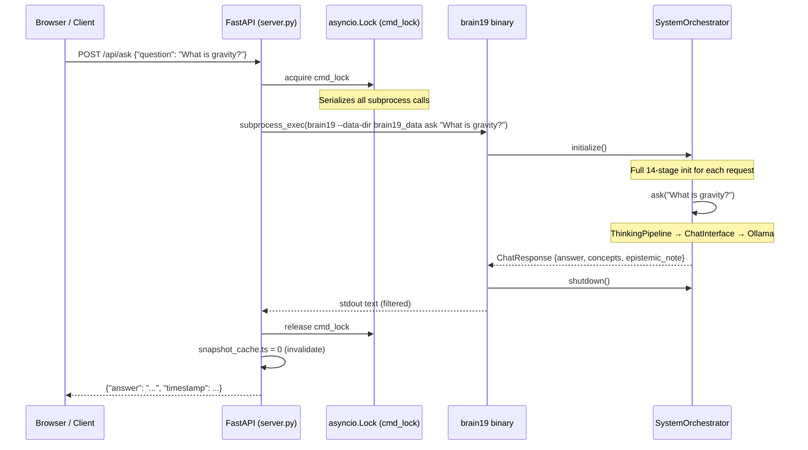
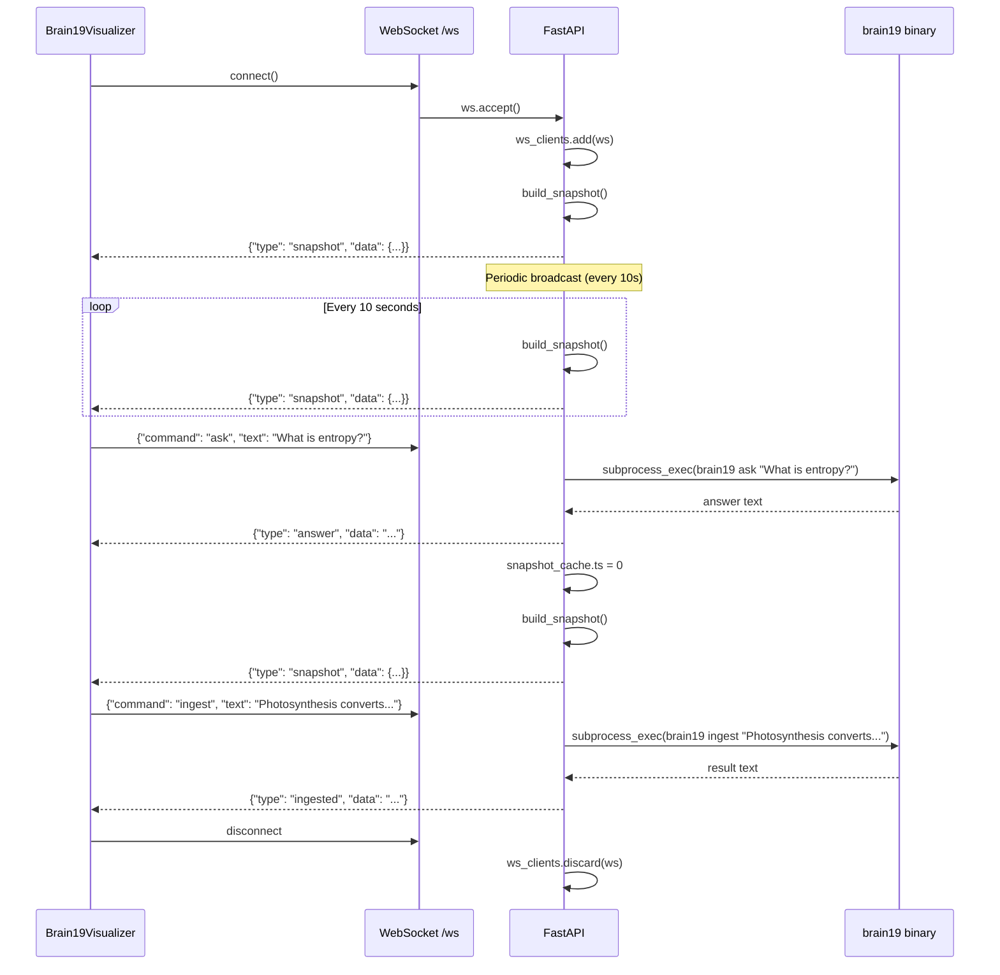
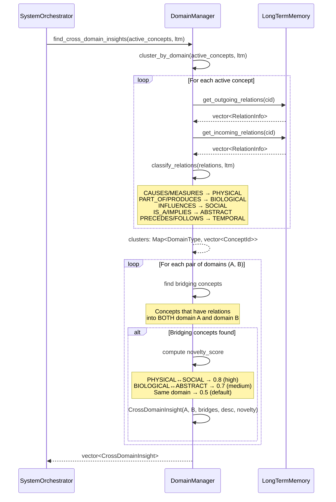
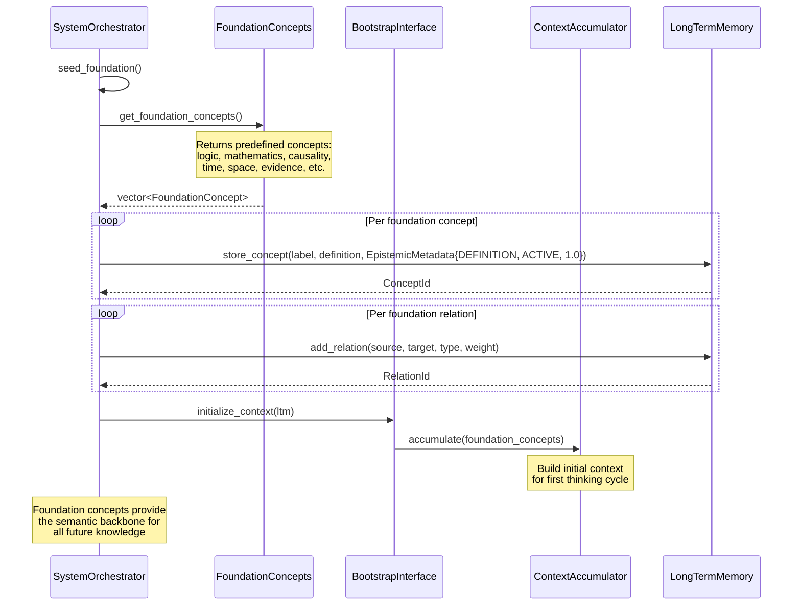
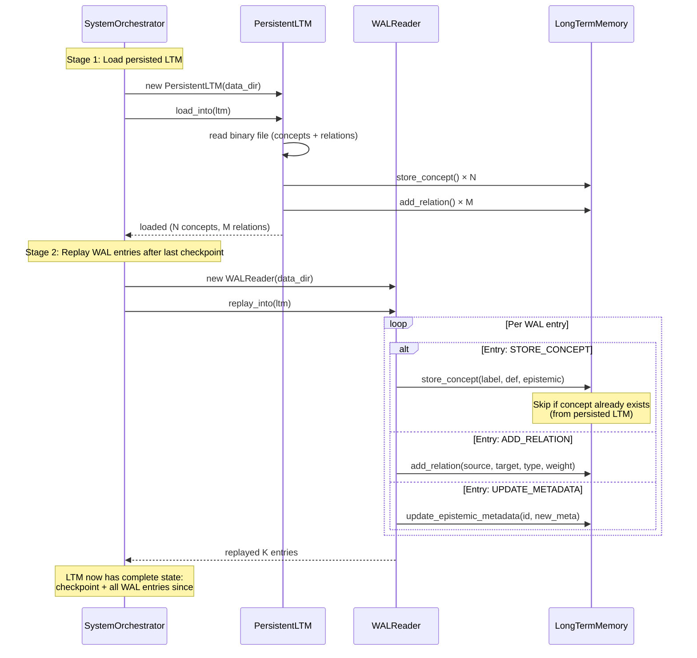
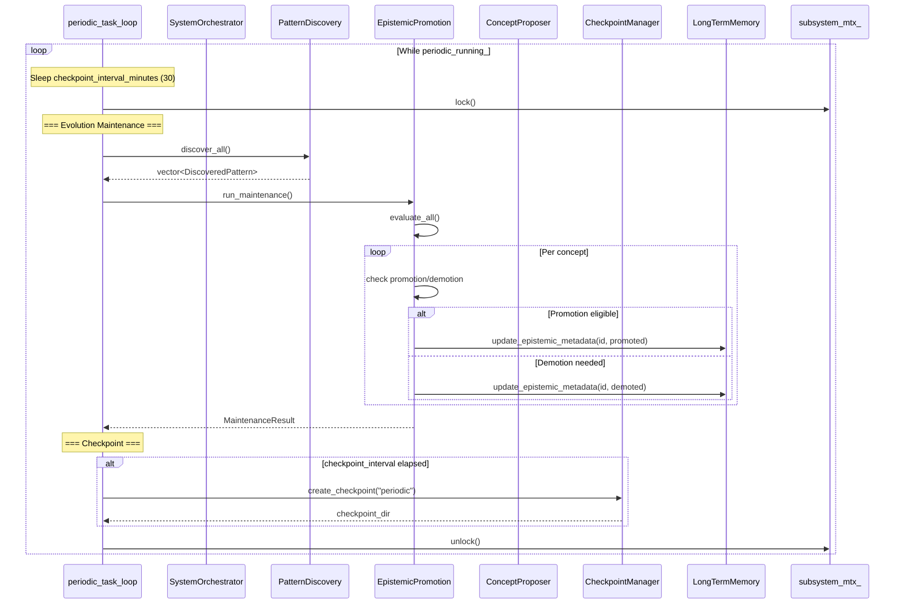
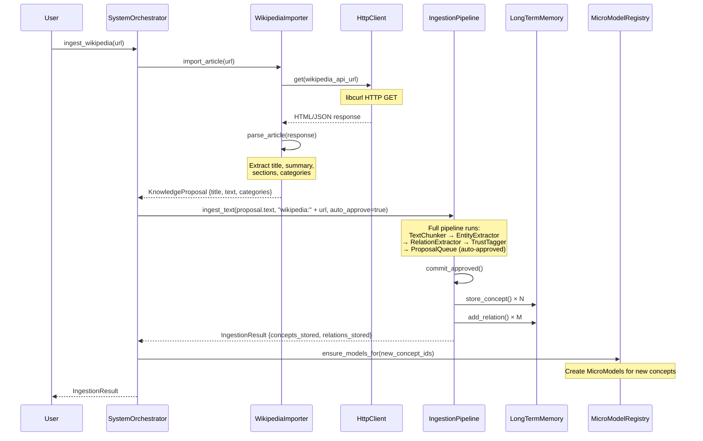
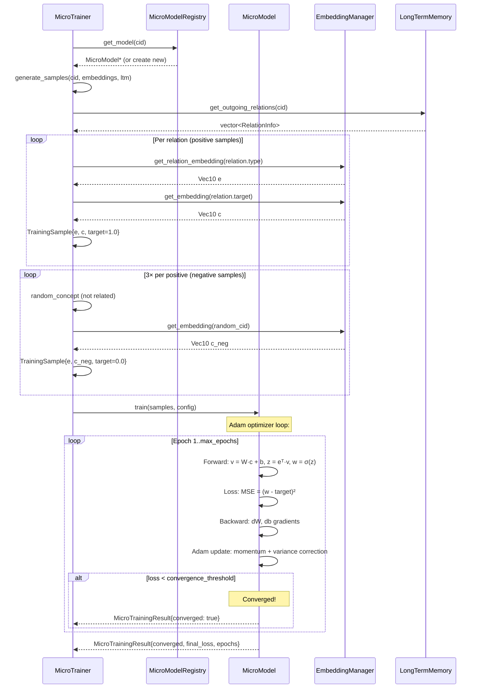
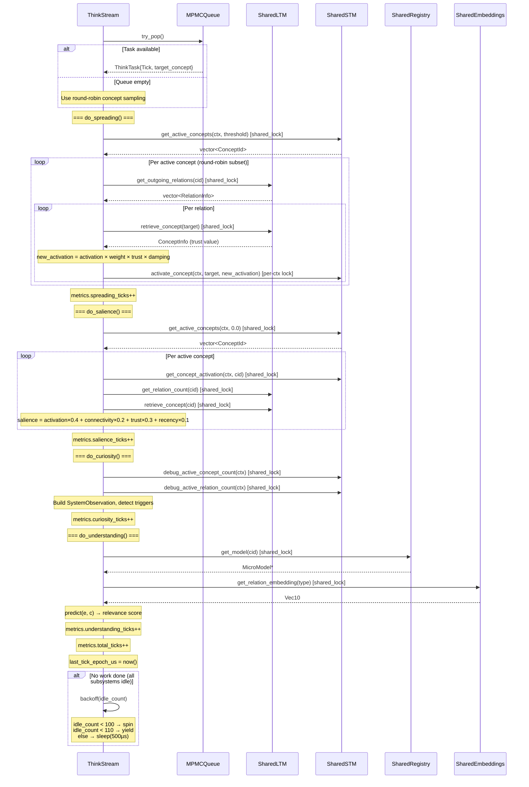

# Brain19 — Sequence Diagrams (Extended)

> Detailed sequence diagrams for secondary and cross-cutting workflows.
> Complements the primary diagrams in [ARCHITECTURE_DIAGRAMS.md](ARCHITECTURE_DIAGRAMS.md).
> Updated: 2026-02-12

---

## Table of Contents

1. [API Request Lifecycle (REST)](#1-api-request-lifecycle-rest)
2. [WebSocket Real-Time Flow](#2-websocket-real-time-flow)
3. [Cross-Domain Insight Discovery](#3-cross-domain-insight-discovery)
4. [Bootstrap — Foundation Seeding](#4-bootstrap--foundation-seeding)
5. [WAL Recovery on Startup](#5-wal-recovery-on-startup)
6. [Periodic Maintenance Cycle](#6-periodic-maintenance-cycle)
7. [Wikipedia Import Pipeline](#7-wikipedia-import-pipeline)
8. [MicroModel Training Cycle](#8-micromodel-training-cycle)
9. [ThinkStream Tick with All Subsystems](#9-thinkstream-tick-with-all-subsystems)

---

## 1. API Request Lifecycle (REST)

How a REST API call flows through the Python bridge to the C++ binary and back.

---

## 2. WebSocket Real-Time Flow

WebSocket connection for real-time updates and interactive commands.

---

## 3. Cross-Domain Insight Discovery

DomainManager finds creative connections between different knowledge domains.

---

## 4. Bootstrap — Foundation Seeding

How foundation concepts are seeded when Brain19 starts for the first time.

---

## 5. WAL Recovery on Startup

Write-Ahead Log replay during system initialization to recover from crashes.

---

## 6. Periodic Maintenance Cycle

The background thread that runs evolution, checkpoints, and cleanup.

---

## 7. Wikipedia Import Pipeline

Full flow from Wikipedia URL to LTM concepts.

---

## 8. MicroModel Training Cycle

Detailed training flow for a single concept's MicroModel.

---

## 9. ThinkStream Tick with All Subsystems

A single complete tick of a ThinkStream showing all subsystem interactions.

---

*Generated from actual code in `backend/` and `api/`. Updated: 2026-02-12.*
