# Brain19 — State Diagrams

> UML state machine diagrams for all stateful components.
> All states, transitions, and guards match the actual code in `backend/`.
> Updated: 2026-02-12

---

## Table of Contents

1. [ThinkStream State Machine](#1-thinkstream-state-machine)
2. [EpistemicStatus Lifecycle](#2-epistemicstatus-lifecycle)
3. [EpistemicType Promotion Ladder](#3-epistemictype-promotion-ladder)
4. [System Initialization Stages](#4-system-initialization-stages)
5. [Concept Lifecycle](#5-concept-lifecycle)
6. [Proposal Lifecycle](#6-proposal-lifecycle)
7. [MicroModel Training State](#7-micromodel-training-state)
8. [Refinement Loop State](#8-refinement-loop-state)
9. [STM Entry Activation State](#9-stm-entry-activation-state)

---

## 1. ThinkStream State Machine

Each ThinkStream has a `StreamState` enum that follows this state machine. Transitions are atomic.

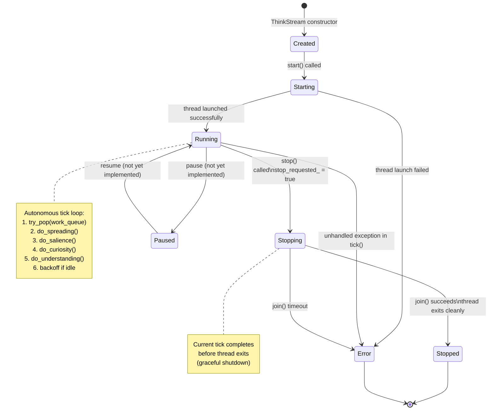

---

## 2. EpistemicStatus Lifecycle

Every ConceptInfo in LTM has an EpistemicStatus. Knowledge is NEVER deleted — only transitions between statuses.

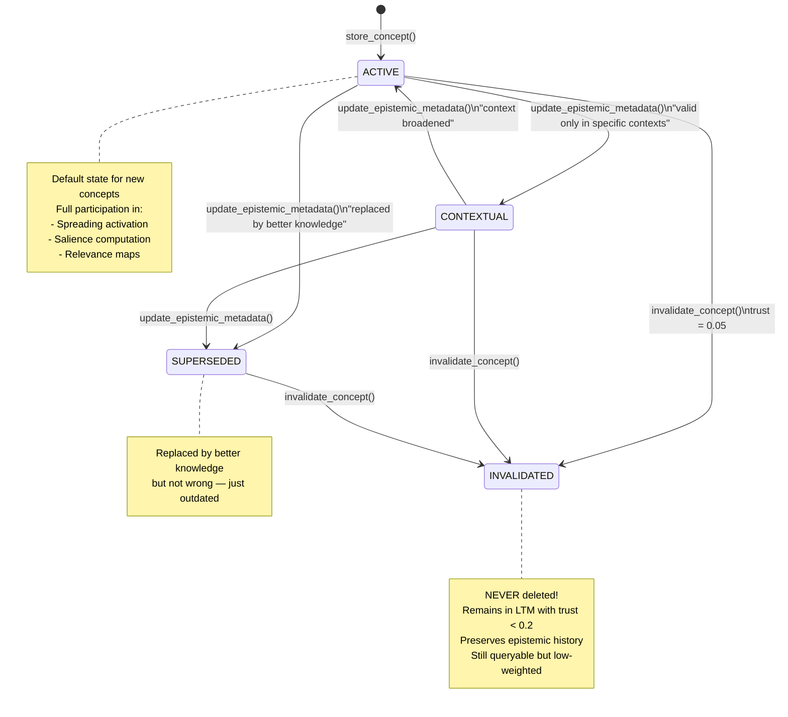

---

## 3. EpistemicType Promotion Ladder

The epistemic promotion system manages knowledge certainty levels. Each transition has specific requirements.

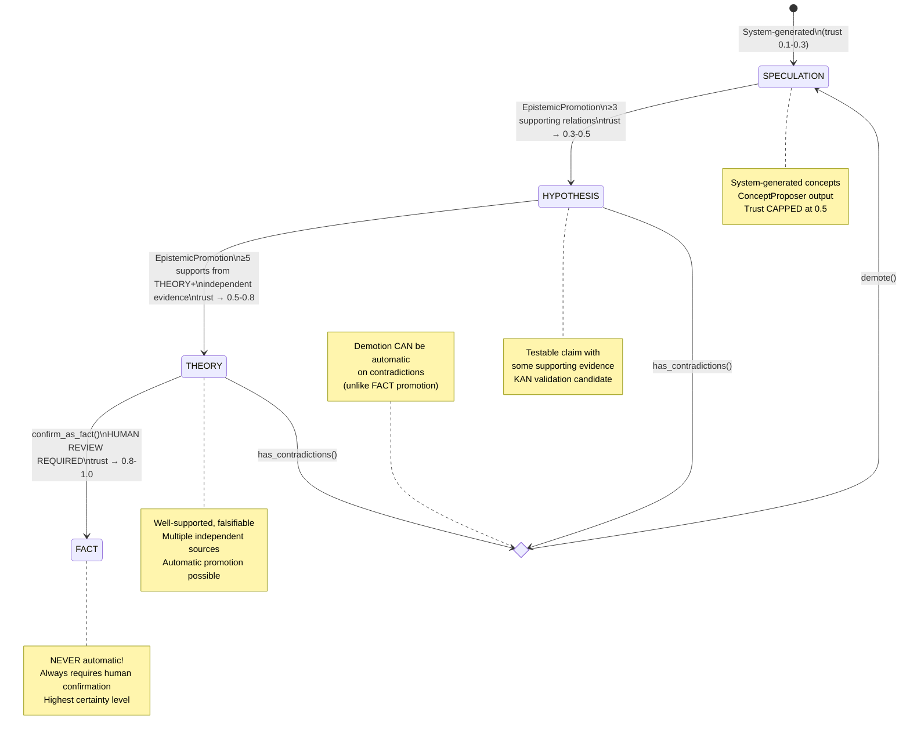

**Additional epistemic types** (entered via direct construction, not through promotion):

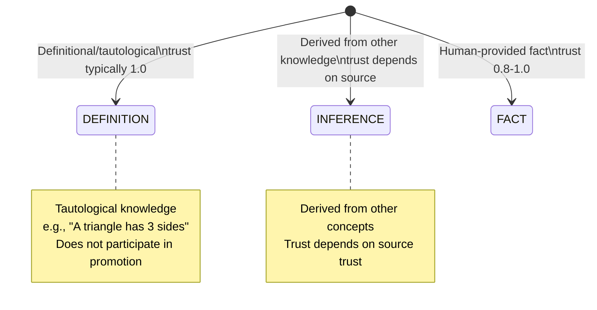

---

## 4. System Initialization Stages

SystemOrchestrator tracks initialization progress via `init_stage_`. On failure, `cleanup_from_stage()` tears down in reverse order.

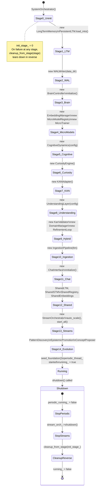

---

## 5. Concept Lifecycle

A concept's complete lifecycle from creation through ingestion to potential invalidation.

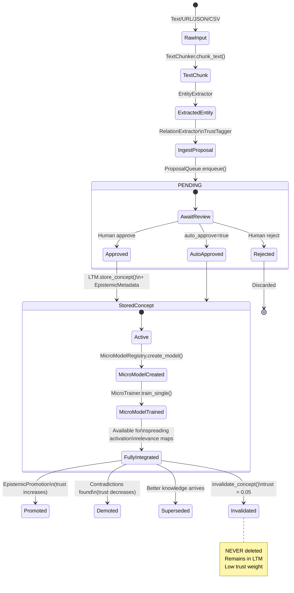

---

## 6. Proposal Lifecycle

IngestProposal status transitions in the ProposalQueue.

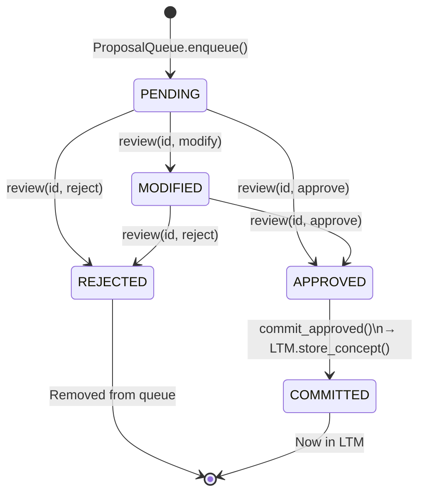

---

## 7. MicroModel Training State

Training lifecycle for a single MicroModel via Adam optimizer.

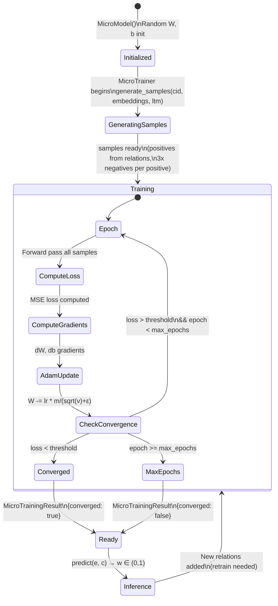

---

## 8. Refinement Loop State

The LLM↔KAN bidirectional refinement process.

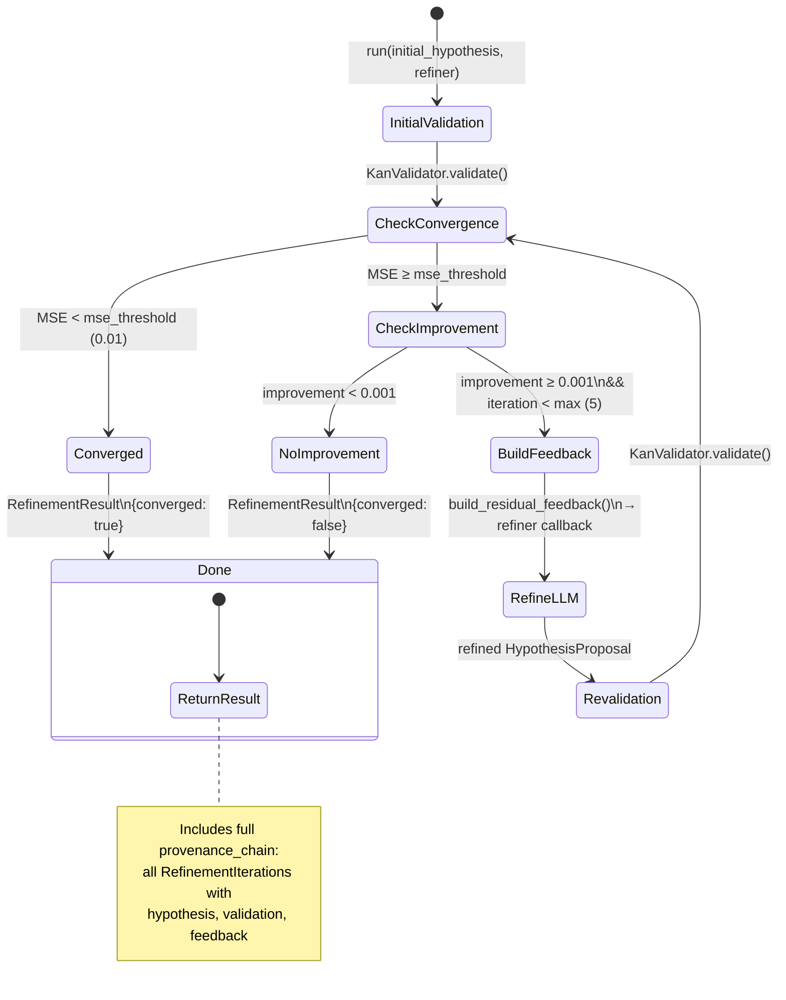

---

## 9. STM Entry Activation State

Activation levels in Short-Term Memory follow a decay model with explicit boosting.

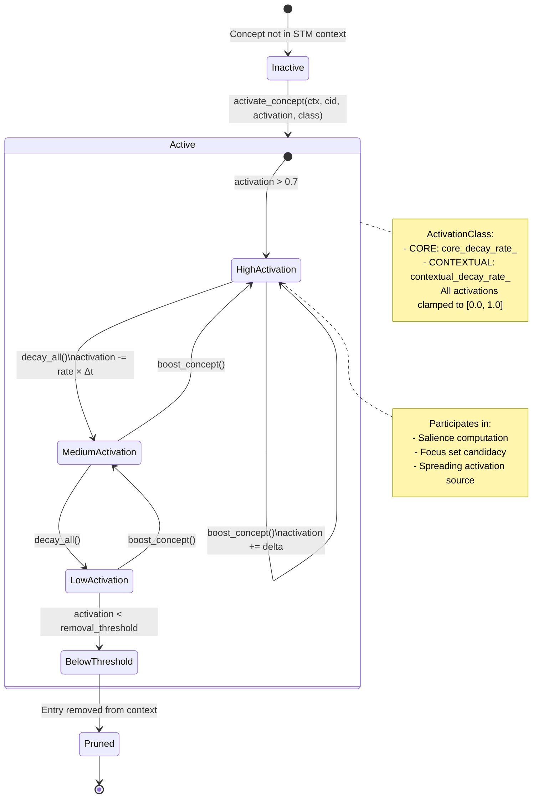

---

## Appendix: Domain Type Classification

How DomainManager classifies concepts into knowledge domains based on their relations.

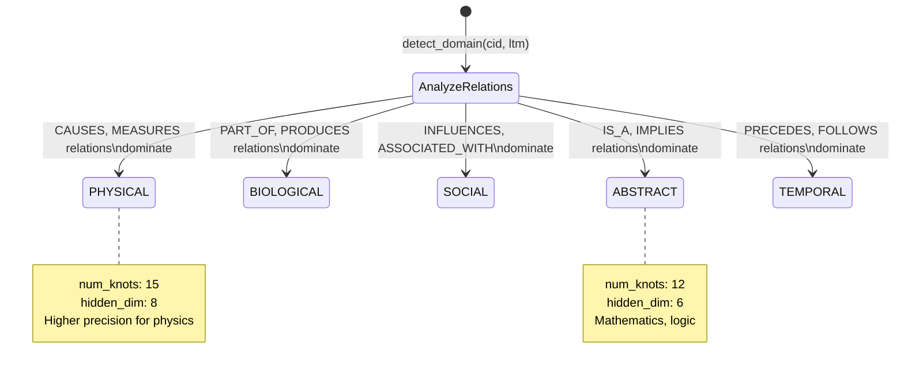

---

*Generated from actual code in `backend/`. Updated: 2026-02-12.*
